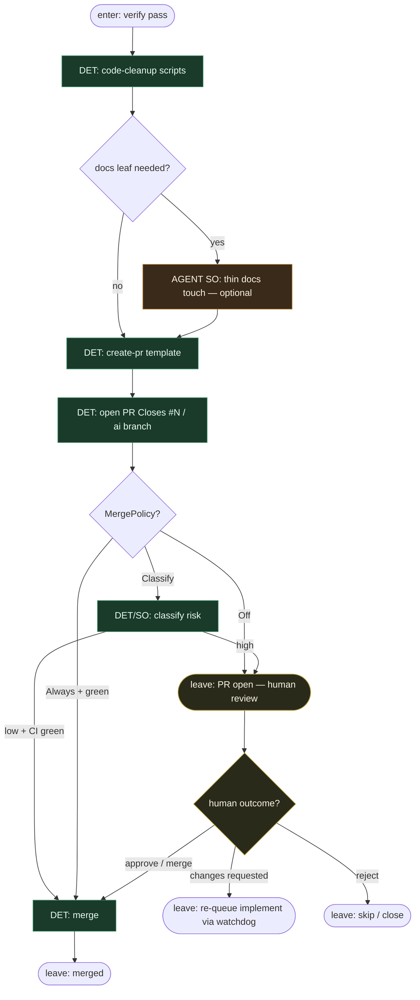

# Subgraph: pr-ceiling

**Theme:** code-cleanup → docs → `create-pr`; stop na human review (MergePolicy Off).  
**Mode mix:** DET spine; opcjonalny cienki LLM docs leaf; HITL na merge.

## Flow

## Notes

- **Coder ceiling = open PR.** Jak DAGent: fabryka kończy na PR for human review — nie lights-out merge.
- **Default MergePolicy = Off.** Zgodne z KLEPACZ / ready-for-agent; Classify/Always to jawne warianty DET.
- **Cleanup/docs nie są orkiestracją.** Skrypty + opcjonalny wąski SO; nie „agent decyduje czy w ogóle robić PR”.
- **Branch convention.** `ai/issue-N` (lub hostowy odpowiednik DAGent); K=1 per ticket/spec.
- **Reviewer path.** Krytyczny `pr_review` specialist może biec *przed* create-pr (DAG edge) albo jako osobny pass po otwarciu — zawsze osobne siedzenie od implement.
- **Handoff contract.** `{pr_url, number, head, merge_policy, state: open|merged|changes}`.
