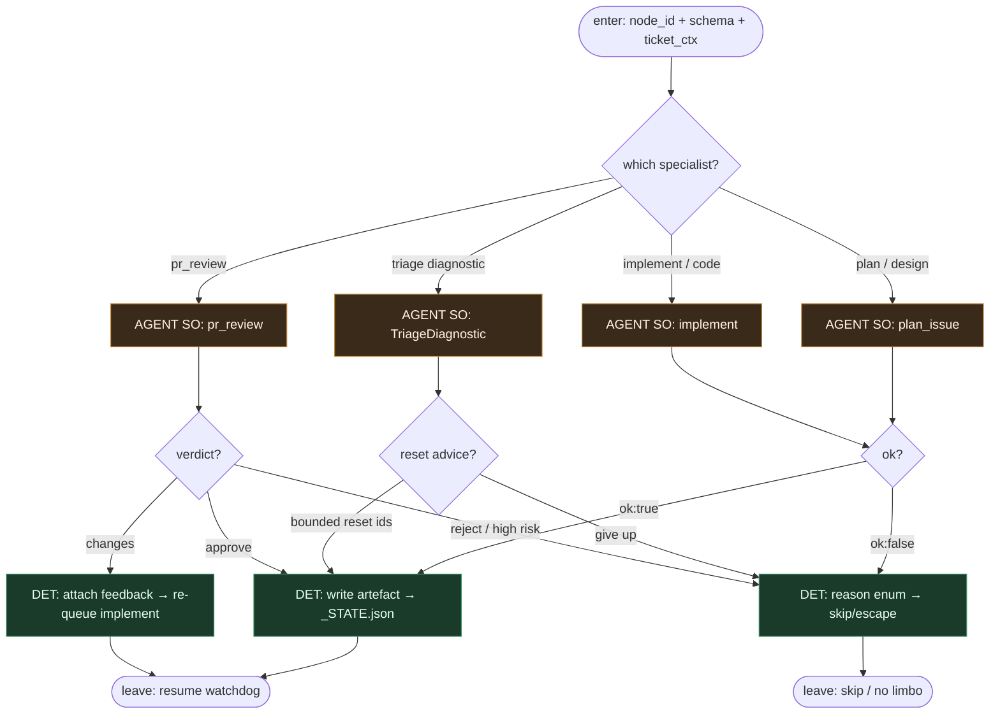

# Subgraph: specialist-llm

**Theme:** węzły specjalistów — **jedyny** sink LLM; structured output, zero routingu.  
**Mode mix:** AGENT SO leaves. Watchdog / git / CI = poza tym podgrafem.

## Flow



## Notes

- **LLM fills specialist nodes only.** Prompt + JSON schema → obiekt. Nie woła „następnego toola ze świata”; nie mutuje DAG.
- **Mapowanie ~12 agentów DAGent → cienkie liście klepacza.** Fazy DAGent zwijamy do: `plan_issue`, `implement` (+ opc. task-breakdown), `TriageDiagnostic`, `pr_review`. Reszta faz (deploy/docs) = DET w innych podgrafach.
- **Coder ≠ merge ≠ push.** Implement nie pushuje i nie otwiera PR — to DET w verify-heal / pr-ceiling.
- **Reviewer ≠ implementer.** Osobny specialist / osobne siedzenie; nigdy self-stamp.
- **TriageDiagnostic ≠ nieskończony heal.** Zwraca listę node_ids do resetu; limity egzekwuje verify-heal / watchdog (≤5).
- **ok:false bez limbo.** `underspecified | too_large | dangerous | cant_comply` → skip; park labels wyłączone.
- **Meat ≡ AI.** Człowiek może wypełnić ten sam schema; watchdog nie wie.
- **Handoff contract.** `{node_id, so_payload, ok}` albo `{ok:false, reason}` + opc. `{reset_node_ids[]}` dla triage.

## Structured output (skrót)

```json
{ "ok": true, "goal": "...", "files": ["..."], "test_command": "...", "non_goals": ["..."], "stop_if": ["auth","migration"] }
```

```json
{ "ok": true, "summary": "...", "files_touched": ["..."], "tests_hint": "..." }
```

```json
{ "ok": true, "diagnosis": "...", "reset_node_ids": ["implement","verify"], "stop": false }
```

```json
{ "verdict": "approve"|"changes"|"reject", "reasons": ["..."], "risk": "low"|"high" }
```
