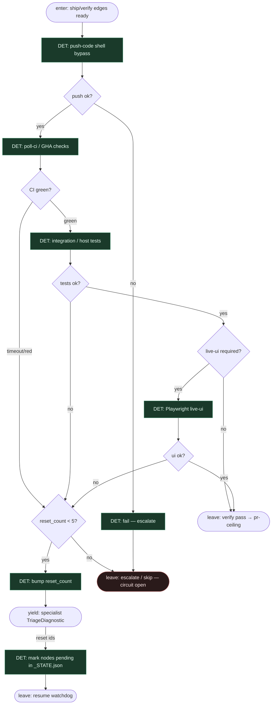

# Subgraph: verify-heal

**Theme:** DET push → poll-ci → testy (+ live-ui gdy host ma); bounded triage reset ≤5.  
**Mode mix:** DET majority; LLM tylko gdy watchdog odda `TriageDiagnostic` (przez specialist-llm).

## Flow

## Notes

- **Shell bypass = DET.** `push-code` / `poll-ci` bez modelu (jak DAGent). Constitutional git wrappers OK.
- **Live-ui opcjonalne na hoście klepacza.** Playwright na żywym env to wzorzec DAGent; jeśli host nie ma deploy — wystarczy CI + unit/integration DET.
- **Circuit breaker ≤5.** `reset_count` w `_STATE.json`; po limicie escalate — nie „agent napraw świat”.
- **Triage jest liściem, nie orkiestratorem.** Diagnosis SO mówi *co* zresetować; watchdog *wykonuje* reset readiness.
- **Fail closed.** Czerwony CI bez budżetu → idle/escalate z komentarzem na ticket/PR draft — nie ciche limbo.
- **Handoff contract.** Pass = `{verify: ok, head_sha, checks[]}`; heal = `{reset_node_ids[], reset_count}`; exhaust = `{ok:false, reason: "circuit_open"}`.
