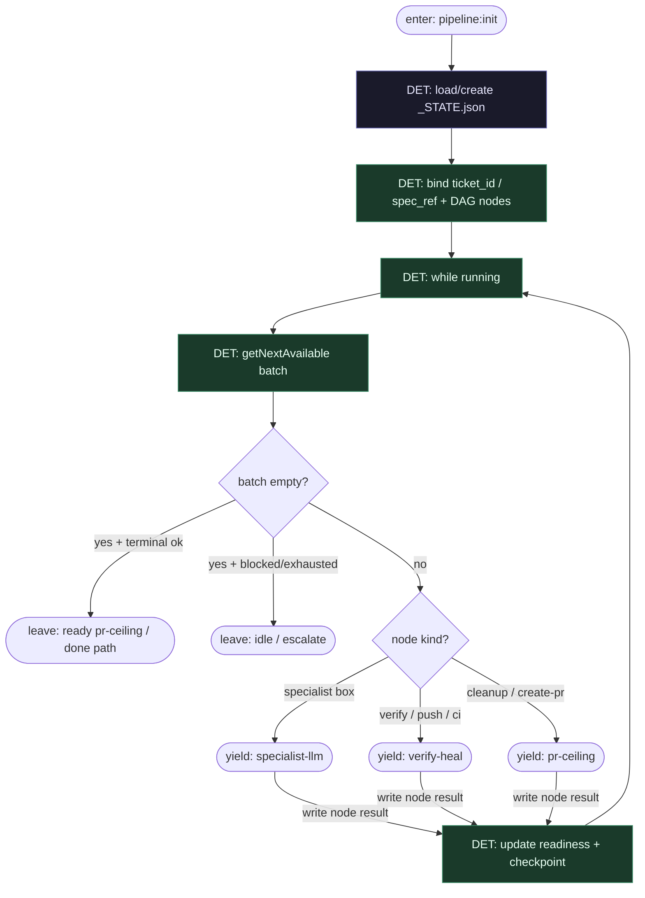

# Subgraph: watchdog-dag

**Theme:** explicytny TypeScript DAG + watchdog `getNextAvailable` — orkiestracja bez LLM.  
**Mode mix:** 100% DET. Zero LLM.

## Flow

## Notes

- **Graph-is-code.** Topologia DAG (edges + prerequisites) żyje w TS / deklaratywnym JSON — nie w prompcie „zrób następny krok”.
- **`getNextAvailable` = scheduler.** Wybiera węzły z spełnionymi deps i wolnym slotem; parallel batch OK gdy DAG na to pozwala (klepacz: zwykle wąski łańcuch K=1).
- **`_STATE.json` = source of truth.** Restart procesu = wczytaj stan; context window modelu nie jest stanem misji.
- **Watchdog nie myśli.** Brak tool-calling orkiestratora; brak LLM przy wyborze batcha.
- **Klepacz bind.** Stage ids: `plan_issue`, `implement`, `push_code`, `poll_ci`, `verify`, `triage_reset`, `create_pr`, `pr_review` — nie research→SSG theatre.
- **Handoff contract.** Yield = `{node_ids[], kind, state_ref, attempt}`; resume = `{node_id, ok, artefact_ref, error?}`.
