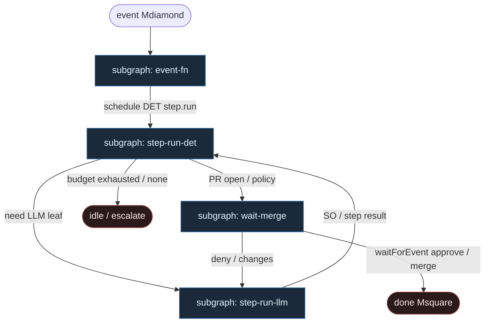

# 31 — Inngest Steps (`step.run` compose)

**Persona:** inngest-steps compose — [Inngest](https://www.inngest.com/): `event` → `createFunction` → DET `step.run` spine; LLM **wewnątrz** jednego `step.run(…)`, nigdy jako router grafu.

**Approach:** compose. Czysty Inngest (nie dual Temporal z [`15-durable-steps`](../15-durable-steps/)). Mapowanie event + memoized steps na duszę klepacza (ticket→PR, nie L5). Durability = memo kroków, nie context window modelu.

## Design notes

- **Event startuje run.** `issues/labeled` / `klepacz/ticket.ready` → `inngest.createFunction`. Label `ready-for-agent` = start; agent nie wybiera sobie pracy z czatu.
- **Function body jest DET.** Ciało `async ({ event, step }) => { … }` = kolejność, `if` na wynikach kroków, pętle budżetu, `step.sleep` / `waitForEvent`. Zero LLM w orkiestracji — inaczej memo/replay się psuje mentalnie (i praktycznie: nondeterminizm kolejności).
- **`step.run` = checkpoint.** Każdy nazwany krok (`"hydrate"`, `"worktree"`, `"implement"`, `"open-pr"`) ma memo. Crash workera / retry funkcji → udane kroki **nie** lecą ponownie.
- **Retry dotyczy kroku, nie misji.** Padnięty `step.run("run-tests")` nie rehydratuje issue; padnięty `"open-pr"` nie re-implementuje. Fail test → function planuje **nowy** `step.run("repair", …)` z `failure_log` — bounded.
- **LLM inside one step.** `await step.run("implement", async () => codingAgent(…))` — model wypełnia SO / edytuje worktree **w** kroku. Nie wybiera następnego `step.run`; wynik `{ ok, artifact }` steruje function body.
- **HITL = `step.waitForEvent`.** Approve/deny / CI green — misja śpi w Inngest, nie w RAM agenta. `step.sendEvent` może emitować sygnały zwrotne.
- **Meat ≡ AI w tym samym slocie.** Ten sam contract kroku; silnik nie rozróżnia kto wypełnił SO.
- **Jeden ticket, jeden PR.** K=1; jedna function run per issue id; occupancy/worktree to DET `step.run`.
- **NOT L5.** Cel: zdjąć wyczerpujące klepanie; merge zostaje przy polityce / człowieku.

## Top-level flowchart



**DET vs AGENT at a glance**

| Layer | Mode | Responsibility |
|-------|------|----------------|
| Inngest event + `createFunction` | DET | Start run; bind `event.data.issue_id` |
| Function body control flow | DET | Order, budget diamonds, continue; replay-safe |
| Step memoization | DET | Source of truth after each named `step.run` |
| hydrate, worktree, test, git, open_pr, merge | DET `step.run` | Idempotent I/O; step-scoped retries |
| plan / implement / review | AGENT inside one `step.run` | LLM fills leaf only; structured output |
| `step.waitForEvent` | HITL | Human / CI approve — not LLM as sole merge gate |
| agent as graph router | — | **FORBIDDEN** — function + memo own next step |

## Index of subgraphs

| File | Theme | Role in chain |
|------|--------|----------------|
| [subgraph-event-fn.md](./subgraph-event-fn.md) | Event → `createFunction` body | DET durable spine + memo |
| [subgraph-step-run-det.md](./subgraph-step-run-det.md) | CODE `step.run`: pick→PR plumbing | Step-scoped retries, idempotency |
| [subgraph-step-run-llm.md](./subgraph-step-run-llm.md) | LLM inside one `step.run` | Entropy slot; not router |
| [subgraph-wait-merge.md](./subgraph-wait-merge.md) | `waitForEvent` + MergePolicy | HITL durability → done |

## Compose map (Inngest → klepacz)

| Inngest concept | Klepacz seat |
|-----------------|--------------|
| Event `klepacz/ticket.ready` / `issues/labeled` | label `ready-for-agent` → one function run per ticket |
| `createFunction` body | fixed FSM ticket→PR (nie department brain) |
| `step.run("…")` CODE | pick, worktree, test, commit, push, open_pr, merge_policy |
| `step.run("…")` LLM | plan_issue / implement / pr_review SO leaves |
| Step memoization | checkpoint po każdym nazwanym kroku; restart = skip done |
| Per-step retry | bounded repair; fail closed |
| `step.waitForEvent("pr/approved")` | MergePolicy Off / human approve |
| `step.sleep` / `sleepUntil` | backoff CI / rate limits bez palenia CPU |
| `step.sendEvent` | emit status / request-review / wake sibling |
| `step.invoke` | opcjonalny pod-function (np. review-only) |
| LLM w function body (poza `step.run`) | **FORBIDDEN** |

## Pseudo-szkielet (ilustracja)

```ts
inngest.createFunction(
  { id: "klepacz-ticket-to-pr" },
  { event: "klepacz/ticket.ready" },
  async ({ event, step }) => {
    const issue = await step.run("hydrate", () => hydrate(event.data.issue_id));
    const wt = await step.run("worktree", () => claimWorktree(issue));
    const plan = await step.run("plan", () => planIssueSO(issue)); // LLM leaf
    await step.run("implement", () => implementSO(plan, wt));     // LLM leaf
    const tests = await step.run("run-tests", () => runTests(wt));
    if (!tests.ok) {
      await step.run("repair", () => repairSO(tests.log, wt));    // bounded
      await step.run("run-tests-2", () => runTests(wt));
    }
    const pr = await step.run("open-pr", () => openPr(wt, issue));
    const verdict = await step.waitForEvent("pr/approved", {
      event: "klepacz/pr.decision",
      match: "data.pr_url",
      timeout: "7d",
    });
    if (verdict?.data.decision === "approve") {
      await step.run("merge-policy", () => mergePolicy(pr));
    }
  },
);
```

## Kryterium sukcesu

Człowiek ma energię na architekturę — bo misja przeżywa restarty i czeka na HITL bez spalania tokenów na orkiestrację. Technicznie: memo `step.run` prowadzi do otwartego (i opcjonalnie zmergowanego) `ai/PR`; LLM nigdy nie wybiera następnego kroku.
