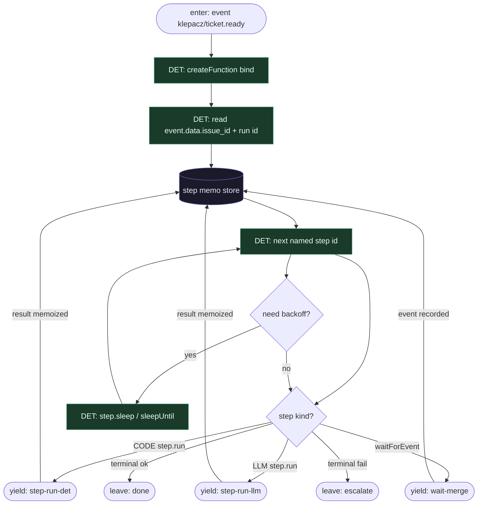

# Subgraph: event-fn

**Theme:** Inngest event → `createFunction` = deterministyczny szkielet; memo `step.run` = źródło prawdy.  
**Mode mix:** DET only. Zero LLM w ciele function (poza wnętrzem `step.run`).

## Flow

## Notes

- **Event = start, nie chat-pick.** Trigger z labela / webhooka / `step.sendEvent` z innego runu. Agent nie skanuje boardu w function body.
- **Replay-safe mental model.** Po restarcie Inngest pomija memoizowane `step.run` i wznawia od pierwszego nieukończonego. Function body musi być czystą kontrolą przepływu na wynikach kroków.
- **Orkiestrator nie myśli.** `next named step id` = stała kolejność klepacza (hydrate → worktree → plan → implement → test → PR → wait → merge_policy) + diamenty budżetu.
- **Durability ≠ agent memory.** Context window modelu nie jest stanem misji. Stan = event + memo kroków.
- **One function run per ticket.** K=1 egzekwowane w DET `worktree` / claim; nie fan-out katalogu w środku runu.
- **Handoff contract.** Yield step-run-det = `{step_id, fn_name, idempotency_hint, input_ref}`; yield step-run-llm = `{step_id, prompt_ref, schema, ticket_ctx, attempt}`; yield wait-merge = `{wait_event, match, timeout, pr_ref, policy}`.
