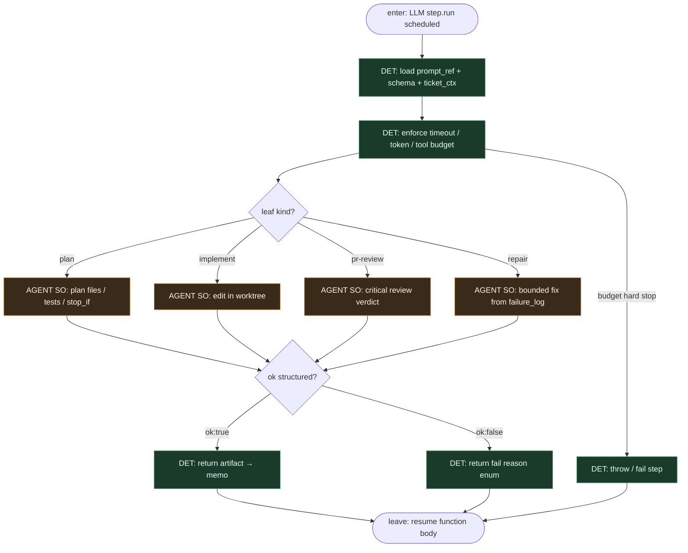

# Subgraph: step-run-llm

**Theme:** LLM siedzi **wewnątrz** jednego `step.run` — wypełnia SO; nie routuje function body.  
**Mode mix:** AGENT leaf only. Function decyduje *kiedy* ten step; wnętrze kroku decyduje *jak* w budżecie.

## Flow

## Notes

- **Not a router.** Model nie wybiera „co dalej”. Nie woła `step.sendEvent` żeby przestawić FSM, nie decyduje o merge, nie skacze po labelach.
- **One step, one leaf.** Plan / implement / review / repair = osobne `step.run` (osobne memo). Reviewer ≠ implementer nawet gdy ten sam vendor modelu.
- **Structured output.** `ok:true` + artefakt (plan.json / diff receipt / verdict) albo `ok:false` + reason enum. Brak limbo chat.
- **Infra retry ≠ blind re-prompt.** Inngest może ponowić padnięty `step.run` przy crashu; semantyka „napraw testy” to **nowy** nazwany step zaplanowany przez function body po `run-tests` fail — z `failure_log` w input.
- **Meat ≡ AI.** Ten sam schema seat; kto wypełni SO nie zmienia krawędzi.
- **Handoff contract.** Leave = `{step_id, ok, artifact_ref, reason?, usage}`; function body zapisuje w memo i idzie dalej DET ścieżką.
