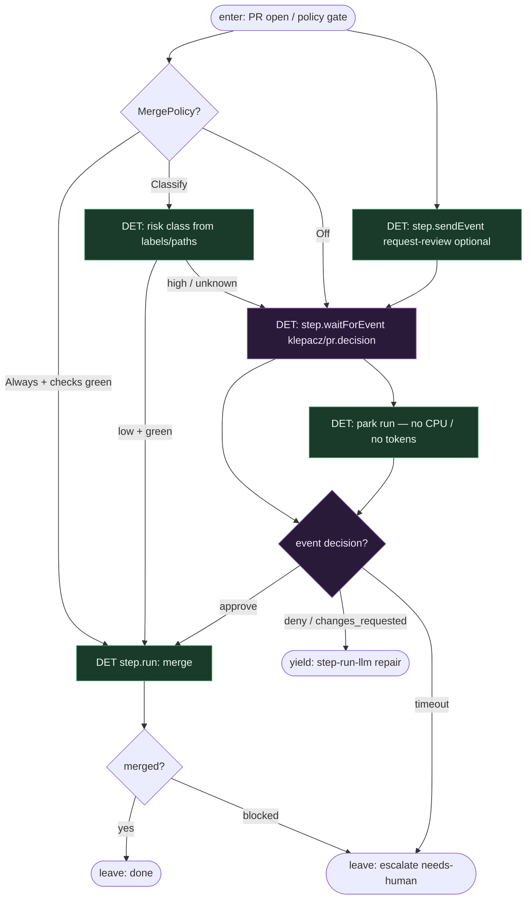

# Subgraph: wait-merge

**Theme:** Durable HITL — `step.waitForEvent` + opcjonalnie `step.sendEvent`; MergePolicy Off|Classify|Always.  
**Mode mix:** HITL + DET policy. LLM nie jest sędzią merge.

## Flow

## Notes

- **Wait is durable.** `step.waitForEvent("pr/approved", { event: "klepacz/pr.decision", match, timeout })` — misja śpi w Inngest, nie w RAM agenta.
- **Policy is CODE.** Off|Classify|Always = atom DET (jak KLEPACZ.md). LLM review może *komentować* w osobnym `step.run`; nie jest jedyną bramką merge.
- **Human owns outcome when Off.** Domyślny klepacz: Off → człowiek approve/deny; factory nie self-merge w limbo.
- **Changes → bounded LLM step.** Deny nie restartuje całego runu od claim; function body planuje repair `step.run` z komentarzami jako input.
- **Optional wake.** `step.sendEvent` może powiadomić reviewera / Slack / inny function — signal, nie router LLM.
- **Handoff.** Leave done = `{pr, merged_sha}`; escalate = `{reason, pr_url}`; yield step-run-llm = `{review_comments, attempt}`.
