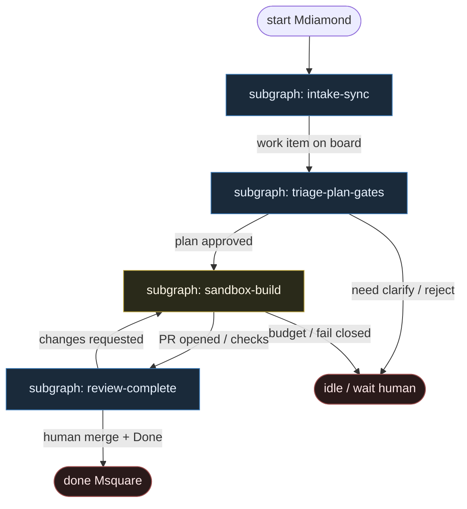

# 32 — Mastra Software Factory (hybrid)

**Persona:** `mastra-hybrid` — [Mastra Factory](https://mastra.ai/factory) / [softwarefactory-template](https://github.com/mastra-ai/softwarefactory-template): **staged** intake → triage → planning → review → completion **gates**, mixed with a **free sandbox build** session in Building.

**Approach:** `hybrid` — **honest label**. To nie jest czysty `compose` (0-token hub jak ElasticClaw/Fabro) ani czysty agent-loop. Połowa maszyny to mierzalne, odwracalne bramki stage’ów + HITL; druga połowa to swobodniejsza sesja coding-agenta w sandboxie między bramkami.

## Design notes

- **Hybrid = dwie prędkości.** Stage machine (Intake / Triage / Planning / Building / Review / Done) jest **explicite** i audytowalna. W Building agent dostaje **persistent sandbox** i tool loop — nie mikro-skrypt „jeden plik / jeden atom”, tylko bounded free build.
- **Ludzie na bramkach.** Triage = Q&A; Planning = approve/edit planu; Review = człowiek merguje. Agent klepie **między** bramkami, nie zamiast nich.
- **Review ≠ Build.** Osobna stacja / sesja review (osobny agent opcjonalnie) — nie self-stamp z tej samej sesji co implementacja.
- **Sandbox.** Mastra platform sandboxes **lub** `FACTORY_SANDBOX_PROVIDER=local`. Per work-item session; teardown po Done / cancel.
- **Klepacz, nie L5.** Sufit kodera = otwarty PR na Review station. Merge zostaje przy człowieku (domyślnie MergePolicy Off).
- **Platform optional.** Template lubi platformę Mastra; klepacz mapuje też `--no-platform` / local — dusza nie wymaga SaaS.
- **Meat ≡ AI.** Ten sam seat na bramce i w sandboxie; silnik nie rozróżnia kto wypełnił artefakt.
- **NOT `/goal` as default.** Opcjonalny goal/subagent mode istnieje w Mastra — **poza** domyślną mapą klepacza; tu default = staged gates + free build.

## Top-level flowchart

**Honest hybrid split**

| Half | Mode | What owns “what’s next” |
|------|------|-------------------------|
| Intake → Triage → Planning → Review → Done | **Staged gates** (DET + HITL) | Factory stage rules / UI actions / human approve |
| Building (sandbox session) | **Free build** (AGENT) | Agent chooses edits/tools *inside* sandbox; **not** next factory stage |
| Merge | HITL | Human in Review — never build session |

## DET vs AGENT at a glance

| Layer | Mode | Responsibility |
|-------|------|----------------|
| GitHub / Linear sync → Intake | DET | Pull issues; board card; no chat-pick |
| Triage Q&A | HITL (+ optional assist SO) | Human answers; stage advances on resolve |
| Planning approve/edit | HITL (+ plan draft SO) | Gate before any free build |
| Sandbox provision + session bind | DET | Platform or local; one work item → one sandbox |
| Building tools / edits | AGENT **free** | Persistent coding agent in sandbox — hybrid free half |
| Repo checks / open PR | DET | CI / gh; ceiling = PR on Review station |
| Review station | HITL (+ optional separate review SO) | Inspect PR; merge or changes-requested |
| Agent flips factory stage past gate | — | **FORBIDDEN** |
| Lights-out auto-merge | — | **FORBIDDEN** (not L5) |

## Index of subgraphs

| File | Theme | Role in chain |
|------|--------|----------------|
| [subgraph-intake-sync.md](./subgraph-intake-sync.md) | GH/Linear → Intake board | DET front: work appears |
| [subgraph-triage-plan-gates.md](./subgraph-triage-plan-gates.md) | Triage + Planning HITL | Staged half: human gates |
| [subgraph-sandbox-build.md](./subgraph-sandbox-build.md) | Free sandbox Building | **Hybrid free half** |
| [subgraph-review-complete.md](./subgraph-review-complete.md) | Review station → Done | HITL merge + completion |

## Compose map (Mastra Factory → klepacz)

| Mastra Factory concept | Klepacz seat |
|------------------------|--------------|
| Issue sync → Intake | labeled / ingested ticket → one work item |
| Triage (agent asks, human answers) | HITL gate + optional assist SO |
| Planning (approve/edit) | plan SO draft → human gate → Building |
| Building in sandbox | **free** implement session (tools in sandbox) |
| Repo checks | DET test / CI babysit |
| Review station (separate session) | review SO optional; human merge |
| Done / completion | terminal; sandbox teardown |
| `/goal` supervisor mode | **out of default map** |
| Agent choosing next stage in chat | **FORBIDDEN** at gates |

## Kryterium sukcesu

Człowiek ma energię na architekturę i niewygodne pytania — bo intake, triage, plan-gate i merge nie są chaotycznym chat-pickiem, a build dzieje się w izolowanym sandboxie. Technicznie: work item przechodzi bramki do otwartego (i opcjonalnie zmergowanego) PR; **approach pozostaje `hybrid`** — staged + free, bez udawania czystego DET spine.
