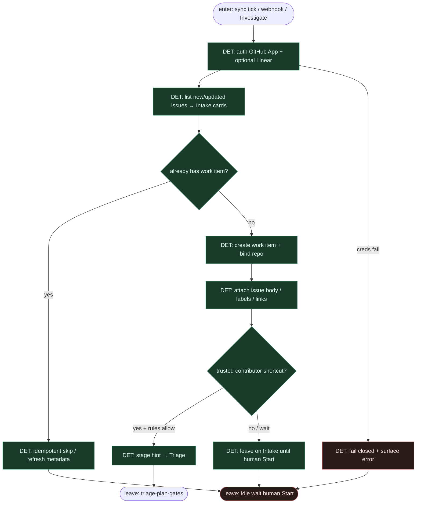

# Subgraph: intake-sync

**Theme:** GitHub / Linear → Factory Intake board — DET wejście; work item bez chat-pick.  
**Mode mix:** DET (+ opcjonalny Slack start). Staged half front.

## Flow

## Notes

- **DET sync, nie agent pick.** Intake to board + rules, nie „agent wybiera sobie issue z czatu”.
- **Idempotencja.** Ponowny sync odświeża metadane; nie dubluje work itemów.
- **Rules as code.** Trusted-contributor → Triage vs wait-on-Intake żyje w Factory rules / deployment config — nie w promptcie liścia.
- **Slack optional.** Start sesji ze Slacka = ten sam work item contract.
- **Handoff.** Leave = `{work_item_id, issue_ref, repo, stage: Intake|Triage, reason}`.
