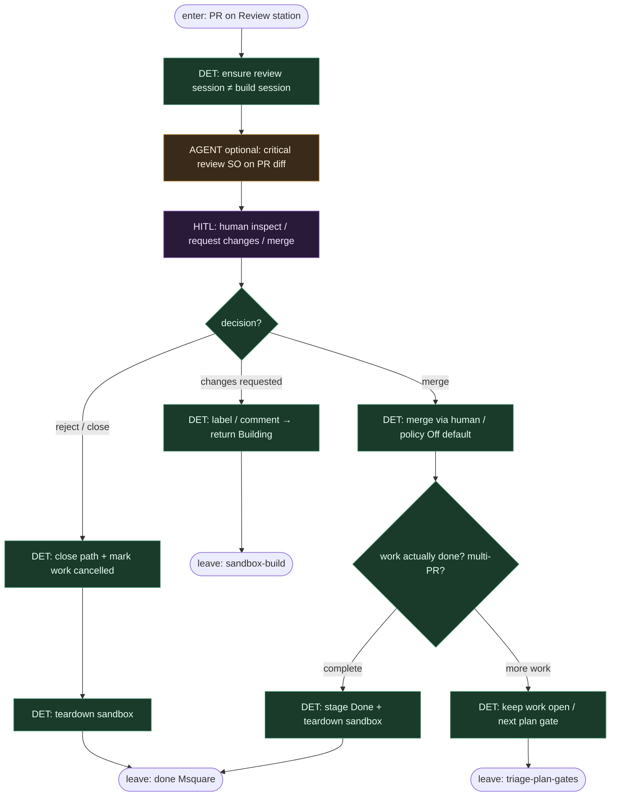

# Subgraph: review-complete

**Theme:** Review station (osobna sesja) → human merge → Done + sandbox teardown.  
**Mode mix:** HITL merge authority; optional AGENT review SO; DET completion.

## Flow



## Notes

- **Reviewer ≠ implementer.** Osobna sesja / opcjonalnie inny model — duch Mastra „review item gets its own session”.
- **Merge ≠ auto Done.** Jedno work item może wymagać >1 PR; completion sprawdza „czy request done?”, nie tylko „czy branch zmergowany”.
- **Human owns merge.** Domyślnie Off; Classify/Always tylko jako świadoma polityka klepacza — nie L5.
- **Teardown.** Po terminal (Done / cancelled) zdejmij sandbox — hybrid free half nie zostawia zombie VM.
- **Handoff.** Leave = `{work_item_id, merged?, done?, sandbox_torn_down}`.

## Structured output (review SO skrót)

```json
{
  "verdict": "approve|changes|reject",
  "reasons": ["..."],
  "risk": "low|high",
  "architecture_flags": ["..."]
}
```
