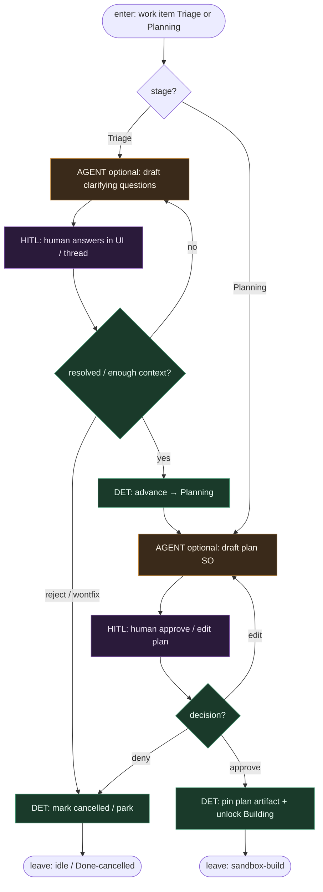

# Subgraph: triage-plan-gates

**Theme:** **Staged half** — Triage Q&A + Planning approve/edit zanim wolny sandbox.  
**Mode mix:** HITL primary; optional AGENT assist SO (pytania / draft planu). Agent **nie** omija bramek.

## Flow



## Notes

- **Bramki są prawdą hybrydy.** Bez approve planu **nie** ma free sandbox build — to odróżnia hybrid od „od razu koduj”.
- **Assist ≠ authority.** SO pyta / draftuje; człowiek zamyka Triage i Planning.
- **Plan artefact.** Outcome / Steps / Files / Test hint / Risks / Ask-or-stop — pin w work item; Building czyta to jako kontrakt.
- **Reversible.** Deny / park wraca do idle bez spalania sandboxa.
- **Handoff.** Leave = `{work_item_id, plan_ref, stage: Building, approved_by}`.

## Structured output (plan draft skrót)

```json
{
  "ok": true,
  "goal": "...",
  "steps": ["..."],
  "files": ["..."],
  "test_command": "...",
  "risks": ["..."],
  "stop_if": ["auth", "migration", "public_api_break"]
}
```
