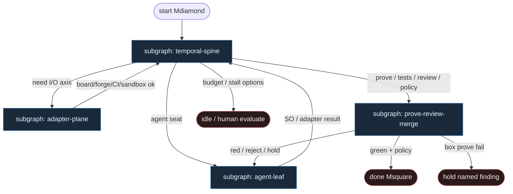

# 33 — OpenFactory (openfactory-core)

**Persona:** openfactory compose — Temporal-ish state machine prowadzi ticket→PR; **adapter axes** (tracker / board / forge / CI / agent / sandbox / notifier) są pluggable; coding agents (Claude Code / Codex / Kimi / OpenCode) siedzą **wyłącznie jako liście** za agent adapterem.

**Approach:** compose. Mapowanie [Open-Factory-Digital/openfactory-core](https://github.com/Open-Factory-Digital/openfactory-core) (WAVE1 / instance `openfactory-core`, conf 85, `spine_deterministic`) na duszę klepacza. **Nie** mylić z numman-ali/openfactory (SDLC Refinery) ani manufacturing Open Factory.

## Design notes

- **FSM jest DET.** Temporal-ish state machine (worker + panel :8787) wybiera następny stan: size → `box prove` → plan → agent → tests → independent reviewer → merge policy. Zero LLM w ciele maszyny stanów.
- **Adapters = osie I/O.** Tracker/board/forge/CI/sandbox/notifier/agent to kontrakty plug-in — orkiestrator nie hardcoduje Jiry ani Claude. Zamiana silnika = nowy adapter, nie nowy graf.
- **Agents are leaves.** Claude Code / Codex / Kimi / OpenCode wypełniają seat za `agent` adapterem. Nie routują FSM, nie flipują board columns, nie są control plane.
- **`box prove` przed kasą.** Setup+validate w real sandbox **zanim** spalasz tokeny. Fail → named finding / hold — nie „agent napraw świat od zera”.
- **Vacuous-green refusal.** Brak zadeklarowanego test command = **hold**, nie pass. Testy to Twoja suite przez CI adapter.
- **Executor ≠ Reviewer.** Independent reviewer = inny silnik / inna sesja adaptera. Ten sam vendor tylko gdy świadomie — default: rozdziel.
- **Jeden ticket, jeden run.** Board pickup → one Temporal-ish run; occupancy/sandbox za adapterami.
- **NOT L5.** Merge w manifeście (Off|Classify|Always); produkcja zawsze za human gate. Honest STATUS.md mindset.

## Top-level flowchart

**DET vs AGENT at a glance**

| Layer | Mode | Responsibility |
|-------|------|----------------|
| Temporal-ish FSM body | DET | Next state, timeouts, retries, continue; replay-safe |
| Adapter axes (tracker…notifier) | DET I/O | Pluggable contracts; idempotent calls |
| `box prove` / your tests / CI | DET | Sandbox truth before & after agent spend |
| Plan / implement behind agent adapter | AGENT leaf | Claude/Codex/Kimi/OpenCode fill seat only |
| Independent reviewer (other engine) | AGENT leaf | Separate adapter session; not same leaf as implement |
| Merge policy Off\|Classify\|Always | DET / HITL | Manifest + human gate on prod |
| Agent as FSM router | — | **FORBIDDEN** — state machine owns next state |

## Index of subgraphs

| File | Theme | Role in chain |
|------|--------|----------------|
| [subgraph-temporal-spine.md](./subgraph-temporal-spine.md) | Temporal-ish FSM body | DET durable spine + state store |
| [subgraph-adapter-plane.md](./subgraph-adapter-plane.md) | Pluggable adapter axes | DET I/O plane; swap without rewiring graph |
| [subgraph-agent-leaf.md](./subgraph-agent-leaf.md) | Coding agent adapter leaves | Entropy slot; Claude/Codex/Kimi/OpenCode |
| [subgraph-prove-review-merge.md](./subgraph-prove-review-merge.md) | box prove → tests → review → policy | Gates before spend + after PR |

## Compose map (openfactory-core → klepacz)

| OpenFactory concept | Klepacz seat |
|---------------------|--------------|
| Board ticket pickup | label/status `ready-for-agent` → one run |
| Temporal-ish state machine | fixed FSM ticket→PR (nie department brain) |
| Adapter: tracker / board | pick + claim + column move |
| Adapter: sandbox + `box prove` | ephemeral worktree prove before spend |
| Adapter: agent (Claude/Codex/Kimi/OpenCode) | plan / implement / bounded-fix SO leaves |
| Adapter: CI + your test suite | run_tests; vacuous-green = hold |
| Independent reviewer (other engine) | critical review SO leaf, osobna sesja |
| Adapter: forge + merge policy | open_pr + Off\|Classify\|Always |
| Adapter: notifier | stall options → human evaluate |
| Panel UI :8787 | observability, nie orkiestracja NLP |
| LLM choosing next FSM state | **FORBIDDEN** |

## Kryterium sukcesu

Człowiek ma energię na architekturę i niewygodne pytania — bo FSM, adaptery i `box prove` nie spalają dnia ani tokenów na klepanie. Technicznie: Temporal-ish run doprowadza do otwartego (i opcjonalnie zmergowanego) `ai/*` PR; agent adapter nigdy nie wybiera następnego stanu.
