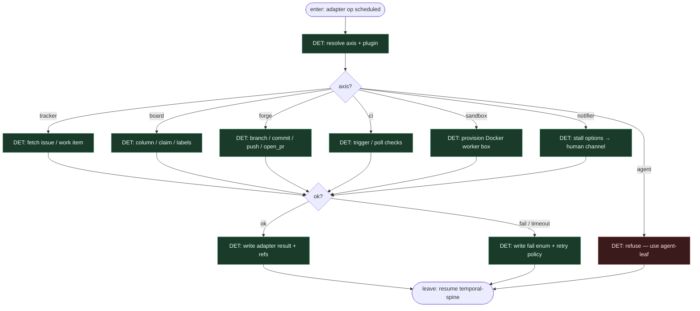

# Subgraph: adapter-plane

**Theme:** Pluggable adapter axes — tracker / board / forge / CI / sandbox / notifier (agent axis → osobny liść).  
**Mode mix:** DET I/O. Swap implementacji bez przełączania grafu.

## Flow

## Notes

- **Osie, nie monolit.** GH Issues+Projects / Jira / Azure DevOps to **tracker+board** pluginy. GitHub/GitLab = forge. Zamiana = nowy adapter, ten sam FSM.
- **Idempotent keys.** Ponowny `open_pr` / `claim` nie duplikuje PR ani double-claim przy replay.
- **Agent axis ≠ ten subgraph.** Wywołanie `agent` stąd jest refuse — entropy idzie przez `subgraph-agent-leaf.md`, żeby silnik (Claude/Codex/…) był jawnie liściem.
- **Sandbox przed spend.** Provision box jest DET; `box prove` żyje w prove-review-merge, ale box ref pochodzi stąd.
- **Notifier = HITL surface.** Stall z executable options → człowiek; nie chat-loop w RAM workera.
- **Handoff contract.** Leave = `{axis, op, ok, refs, reason?, attempts}` → zapis w run state.
