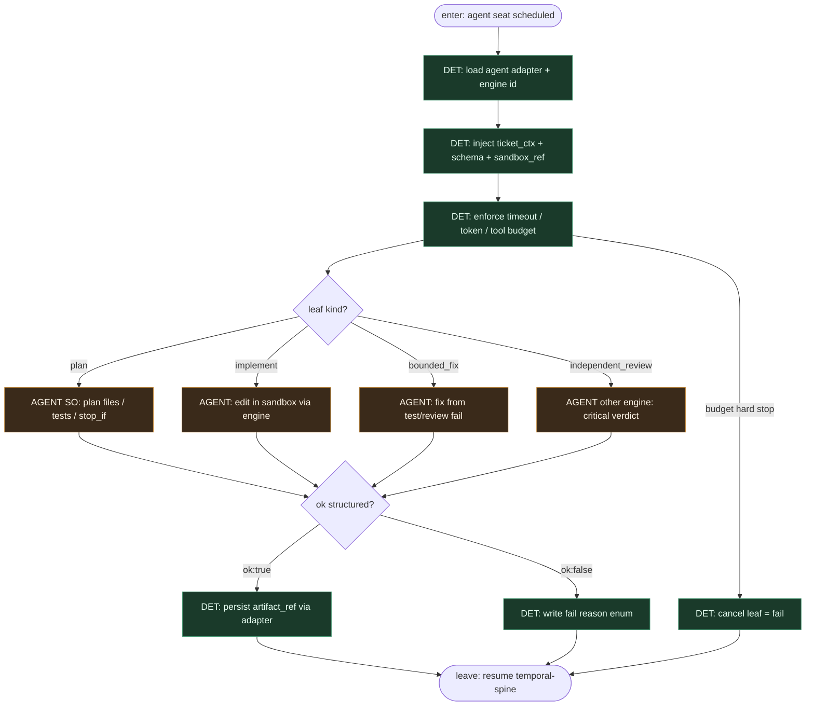

# Subgraph: agent-leaf

**Theme:** Coding agent **za** agent adapterem — Claude Code / Codex / Kimi / OpenCode jako pluggable leaves.  
**Mode mix:** AGENT leaf only. FSM decyduje *kiedy*; adapter+silnik wypełnia SO.

## Flow

## Notes

- **Leaf, not brain.** Model nie wybiera następnego stanu FSM, nie przestawia board columns, nie woła merge, nie jest control plane.
- **Pluggable engines.** Ten sam seat: Claude Code / Codex / Kimi / OpenCode — wybór w manifeście / adapter config, nie w prompcie „zostań orkiestratorem”.
- **Executor ≠ Reviewer.** `independent_review` = **inny** engine id (albo co najmniej osobna sesja adaptera). Implement i review nie dzielą jednego kontekstu „sam siebie pochwal”.
- **Structured output.** `ok:true` + artefakt (plan.json / diff receipt / verdict) albo `ok:false` + reason enum. Brak limbo chat.
- **Meat ≡ AI.** Ten sam schema seat; kto wypełni SO nie zmienia krawędzi FSM.
- **Handoff contract.** Leave = `{state_id, engine, ok, artifact_ref, reason?, usage}` → Event/run history; spine idzie DET ścieżką.
