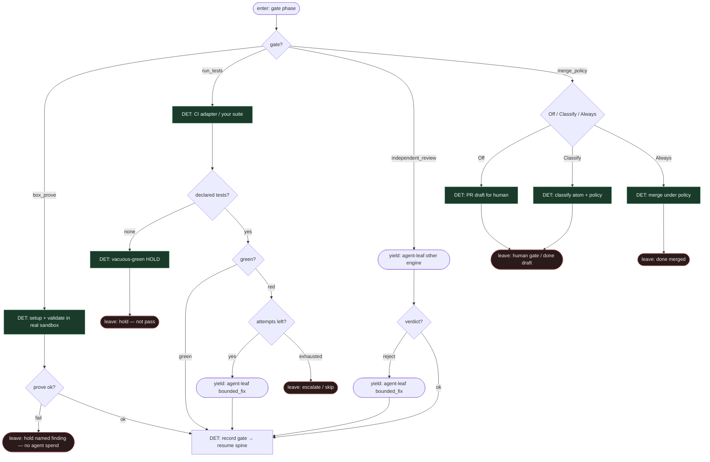

# Subgraph: prove-review-merge

**Theme:** `box prove` przed kasą → your tests → independent reviewer → merge policy.  
**Mode mix:** DET gates + yield AGENT leaves. Fail closed / vacuous-green refused.

## Flow

## Notes

- **Prove before spend.** `box prove` fail = named finding, **zero** tokenów na implement. To wyróżnik openfactory-core wśród low-star mills.
- **Vacuous-green = hold.** Brak test command w projekcie nie jest zielonym CI — hold z powodem, nie silent pass.
- **Reviewer osobno.** Independent review always other engine leaf; reject wraca do bounded_fix, nie do „tego samego chatu”.
- **Coder ceiling = open PR.** Merge to polityka (Off default) + human na prod — nie agent klika merge.
- **Stall → human.** Blocked job dostaje executable options przez notifier; człowiek ewaluuje, nie „agent wymyśl lane”.
- **Handoff.** Leave hold/escalate/done = receipt w run state; yield agent-leaf = `{failure_log|pr_diff, attempt, engine, schema}`.
