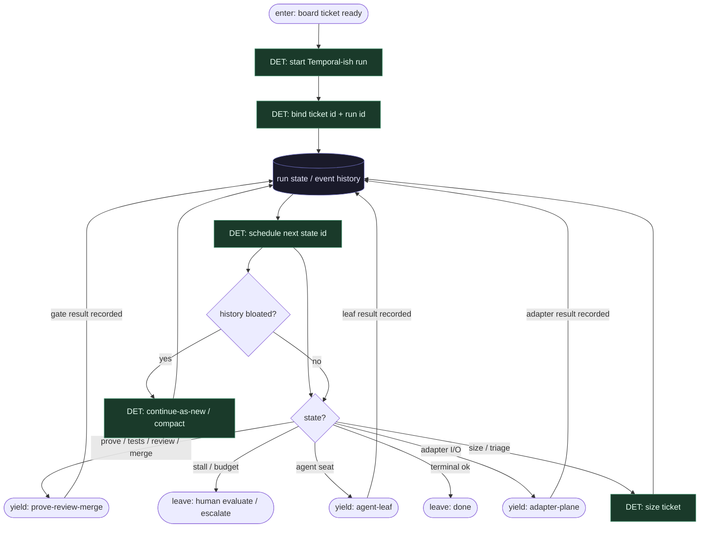

# Subgraph: temporal-spine

**Theme:** Temporal-ish state machine = deterministyczny szkielet; worker state = źródło prawdy.  
**Mode mix:** DET only. Zero LLM w ciele FSM.

## Flow

## Notes

- **Replay-safe.** Ciało FSM czyta tylko zapisany stan + wyniki adapterów/liści. Żadnych LLM / losowych zegarów w transitions (Temporal nondeterminism mindset).
- **Orkiestrator nie myśli.** `schedule next state id` = stała kolejność openfactory (size → box_prove → plan → agent → tests → review → merge_policy) + diamondy budżetu / hold.
- **Durability ≠ agent memory.** Context window modelu nie jest stanem misji. Restart workera = replay / resume run state.
- **One run per ticket.** K=1 occupancy egzekwowane przed startem lub jako pierwszy DET krok; nie fan-out katalogu w środku runu.
- **Panel UI ≠ router.** :8787 pokazuje stany i stall options; człowiek ewaluuje — model nie wybiera lane.
- **Handoff contract.** Yield adapter-plane = `{state_id, axis, op, idempotency_key, input_ref}`; yield agent-leaf = `{state_id, engine, prompt_ref, schema, ticket_ctx, attempt}`; yield prove-review-merge = `{gate, sandbox_ref, pr_ref?, policy}`.
