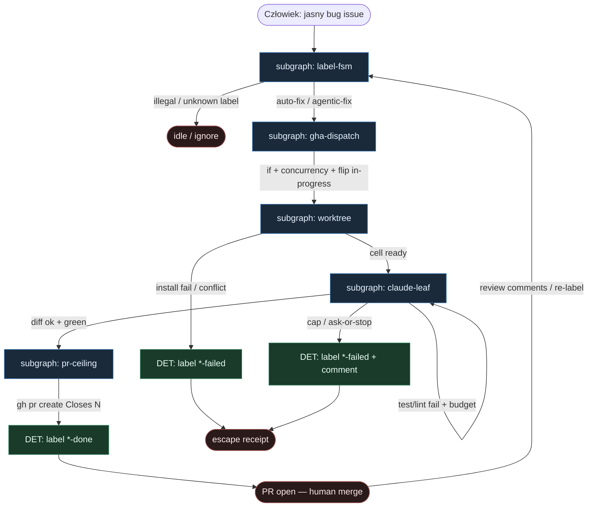

# 34 — JP label auto-fix reuse

**Persona:** `jp-label-reuse` — maksymalna wierność japońskiego DIY klepacza **Label→GHA→worktree→claude→PR** ([jp-label-auto-fix](../../../dark-factory-kb/instances/jp-label-auto-fix/): Solvio `auto-fix` + JBS `agentic-fix`). **Label FSM owns stages** — etykiety są stanem; GHA/skrypt flipuje; Claude CLI jest liściem.

**Approach:** `reuse_ready`. Nie wymyślamy orkiestratora SaaS — bierzemy praktykę JP 2026 (Zenn Solvio + JBS Tech Blog) i rozkładamy na podgrafy DET-majority zgodne z SOUL / KLEPACZ / ready-for-agent.

## Design notes

- **Label = start i stan.** `issues.labeled` z `auto-fix` (Solvio) albo `agentic-fix` (JBS). Zero agent pick z czatu / unlabeled backlogu.
- **Label FSM owns stages.** Solvio: `auto-fix` → `in-progress` → `auto-fix-done` / `auto-fix-failed`. JBS: `agentic-fix` → (phases) → `agentic-fix-done` / `agentic-fix-failed`. Tylko GHA/skrypt wolno flipować; agent **nie** woła `gh label` sam z siebie.
- **GHA = dispatch spine.** Fixed workflow: `if:` na etykiecie → concurrency per issue → checkout → worktree → invoke Claude → test/lint → PR albo failed. YAML jest programem; LLM nie dopisuje `steps:`.
- **Fresh worktree.** Solvio: `git worktree` na self-hosted (lub hosted) runnerze. Jedna misja = jeden worktree = jeden branch. K=1 occupancy.
- **Claude CLI = liść AGENT.** `claude -p … --dangerously-skip-permissions` (headless). Entropy tylko w fixie; nie routuje FSM, nie merguje.
- **Bounded retry.** JBS: test loop ≤3 + re-fix ≤2; Solvio: lint (`pnpm check:fix`) + timeout (~30m). Cap wyczerpany → `*-failed` + comment.
- **Coder ceiling = draft/open PR.** `gh pr create` z `Closes #N`. Merge = **zawsze człowiek** (zalecenie autorów JP; MergePolicy default **Off**).
- **DET majority.** Label parse, mutex stage, concurrency, worktree, install, test gate, push, PR, flip done/failed — skrypt/GHA. AGENT tylko w CLI leaf.
- **Meat ≡ AI.** To samo siedzenie w liściu; graf bez zmian gdy wypełnia człowiek-klepacz vs Claude.
- **NOT L5.** Zdejmujemy klepanie bug→branch→PR. Nie auto-merge feature’ów, nie migracje/security bez holdoutu, nie lights-out bank.
- **Cel (SOUL):** człowiek ma energię na review i niewygodne pytania — bo nie spalił dnia na ticket→worktree→push→PR.

## Top-level flowchart

**DET vs AGENT at a glance**

| Warstwa | Mode | Skąd (reuse JP) | Uwaga |
|---------|------|-----------------|-------|
| Label `auto-fix` / `agentic-fix` | DET FSM | Solvio / JBS | agent nie wybiera pracy |
| Flip `in-progress` / `*-done` / `*-failed` | DET | GHA/script only | FSM owns stages |
| GHA `on: issues.labeled` + `if:` | DET | fixed YAML | spine bez LLM |
| `git worktree` + branch | DET | Solvio cell | K=1 per issue |
| `claude -p` headless | AGENT leaf | Claude Code CLI | entropy tylko tu |
| Lint / test retry ≤N | DET gate + leaf loop | Solvio lint / JBS ≤3 | cap → failed |
| `gh pr create Closes #N` | DET | Submit phase | coder ≠ merge |
| Human merge | HITL | zalecenie JP | MergePolicy Off |

## Index of subgraphs

| File | Theme | Role in chain |
|------|--------|----------------|
| [subgraph-label-fsm.md](./subgraph-label-fsm.md) | etykiety = stany FSM | DET kręgosłup; owns stages |
| [subgraph-gha-dispatch.md](./subgraph-gha-dispatch.md) | GHA labeled + concurrency | DET trigger → invoke |
| [subgraph-worktree.md](./subgraph-worktree.md) | fresh worktree / branch | DET sandbox komórka |
| [subgraph-claude-leaf.md](./subgraph-claude-leaf.md) | Claude CLI headless + retry | jedyny AGENT entropy sink |
| [subgraph-pr-ceiling.md](./subgraph-pr-ceiling.md) | PR + done/failed + human merge | coder ceiling |

## Mapowanie JP → klepacz

| JP (Solvio / JBS) | Klepacz seat |
|-------------------|--------------|
| Label `auto-fix` / `agentic-fix` | subgraph-label-fsm start |
| `in-progress` / phase Prepare | GHA flip + subgraph-gha-dispatch |
| `git worktree` / Phase Prepare | subgraph-worktree |
| `claude -p` / Phase Fix | subgraph-claude-leaf (AGENT) |
| lint / test loop Verify | DET gate wokół leaf |
| `gh pr create` Submit | subgraph-pr-ceiling |
| `*-done` / `*-failed` | DET escape / terminal labels |
| Human review + merge | MergePolicy Off (default) |
| Agent as FSM router | **FORBIDDEN** |

## Antyteza (czego tu nie ma)

- Agent wybierający pracę z czatu / unlabeled backlogu
- Agent sam flipujący etykiety „bo tak wyszło z promptu”
- Auto-merge dużych feature’ów / migracji / security bez holdoutu
- Unbounded test/re-fix bez `*-failed`
- Fat orchestrator SaaS zamiast GHA + worktree + CLI
- L5 lights-out / wymyślanie ticketów

## Kryterium sukcesu

Technicznie: branch + otwarty (draft) PR `Closes #N` + etykieta `*-done` (albo czysty `*-failed` z evidence). Ludzko: inżynier reviewuje i merguje — nie babysittował issue→worktree→PR.
