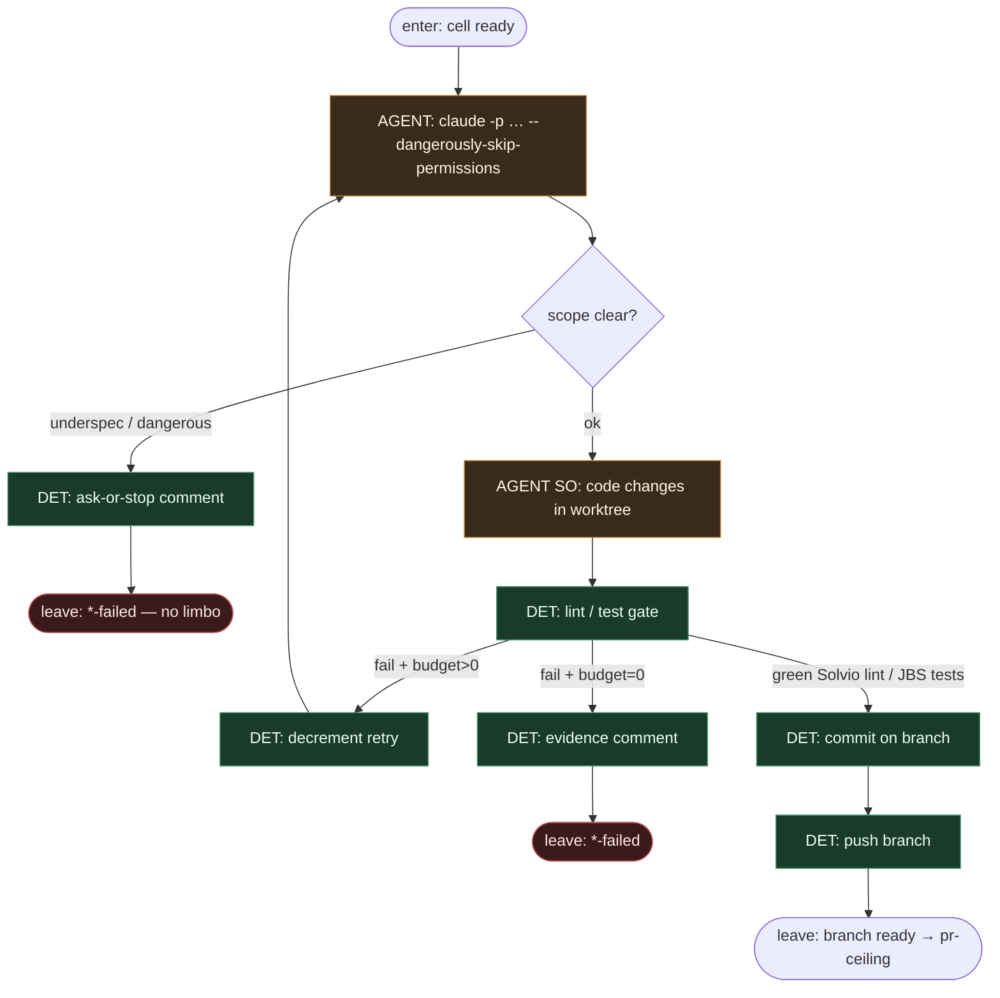

# Subgraph: claude-leaf

**Theme:** Claude Code CLI headless (`claude -p …`) jako **liść AGENT** — fix + opc. self-review; nie orkiestrator FSM.  
**Mode mix:** AGENT w CLI; test/lint gate + retry cap = DET.

## Flow

## Retry budget (compose)

| Family | Gate | Cap | On exhaust |
|--------|------|-----|------------|
| Solvio | `pnpm check:fix` (lint) | timeout ~30m / single pass+ | `auto-fix-failed` |
| JBS | test loop | ≤3 tests + re-fix ≤2 | `agentic-fix-failed` + comment |
| KLEPACZ alias | project test cmd | N from env | `*-failed` |

## Notes

- **Reuse fidelity.** Headless Claude Code CLI na runnerze — ten sam wzorzec co w karcie `jp-label-auto-fix`, nie Marketplace monolith jako router.
- **Liść, nie orkiestrator.** Claude nie flipuje `in-progress`/`done`, nie zmienia MergePolicy, nie otwiera kolejnych issues. Wynik = diff + branch / fail.
- **Ask-or-stop.** Auth, billing, migracje, deps poza Allowed → comment + `*-failed` (KLEPACZ), nie „ulepsz po drodze”.
- **Meat ≡ AI.** To samo siedzenie: CLI albo człowiek-klepacz w worktree contract — graf bez zmian.
- **Flags.** `--dangerously-skip-permissions` tylko w izolowanej komórce worktree/runner; budżet turns/tools = DET wokół liścia.
- **Handoff contract.** `{branch, shas[], summary, retries_used}` \| `{skip, reason}` → pr-ceiling / failed.
