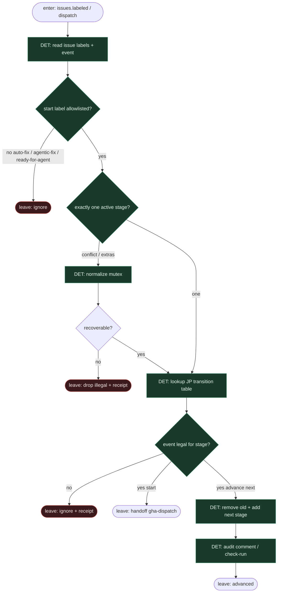

# Subgraph: label-fsm

**Theme:** etykiety = stany FSM; **label FSM owns stages** — tylko GHA/skrypt flipuje; mutex jednej aktywnej stage-label.  
**Mode mix:** 100% DET. Zero AGENT w kręgosłupie.

## Flow

## Transition table (compose JP)

| From | Event / predicate | To | Who flips |
|------|-------------------|----|-----------|
| *(human)* | label `auto-fix` (Solvio) | start → GHA | człowiek |
| *(human)* | label `agentic-fix` (JBS) | start → GHA | człowiek |
| `auto-fix` / `agentic-fix` | job accepted | `in-progress` | GHA |
| `in-progress` | PR created + green | `*-done` | GHA |
| `in-progress` | cap / ask-or-stop / install fail | `*-failed` | GHA |
| `*-done` | human merge | terminal stay | człowiek |
| `*-failed` | human re-label start | re-drive | człowiek |
| `*` | illegal multi-stage | normalize or drop | GHA |

## Notes

- **Reuse fidelity.** Solvio: `auto-fix` → `in-progress` → `done`/`failed`. JBS: `agentic-fix` / `agentic-fix-failed` (+ done). Alias `ready-for-agent` mapuje na ten sam start seat (KLEPACZ).
- **FSM owns stages.** Stan żyje na issue labels — nie w pamięci agenta, nie w czacie. To samo DNA co `09-label-fsm`, słownik krótszy (bugfix DIY).
- **Agent never routes.** Nawet gdy Claude „sugeruje” kolejną etykietę — skrypt czyta enum wyniku (`ok`/`fail`/`defer`) i **sam** mapuje na tabelę. Poza tabelą = `*-failed` albo ignore.
- **Mutex.** Jedna aktywna stage-label naraz; extras strip przed dispatch.
- **Handoff contract.** `{stage, issue_id, family: solvio|jbs|klepacz, next?}` albo `{ignore|drop}`.
