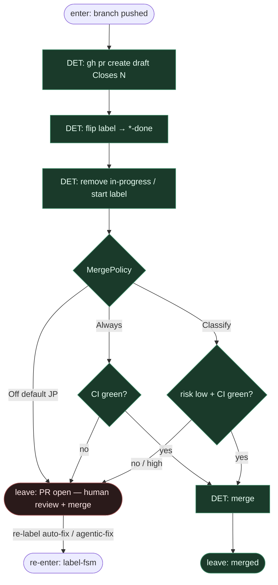

# Subgraph: pr-ceiling

**Theme:** coder ceiling = otwarty (draft) PR + etykieta `*-done`; merge zostaje przy człowieku.  
**Mode mix:** DET open PR + label flip; zero LLM-merge.

## Flow

## Notes

- **Coder ≠ merge.** JP autorzy: zawsze ludzki merge. Default MergePolicy **Off** — zgodne z KLEPACZ / ready-for-agent.
- **Closes #N.** DET body PR linkuje issue; branch już `auto-fix/issue-N` (lub `fix/issue-N`).
- **`*-done` vs merge.** Done = „klepacz skończył sufit PR”, nie „weszło na main”. Failed path nigdy tu nie wchodzi (zostaje w leaf/gha).
- **JBS promotion.** Opc. PR do `devops` potem HITL `devops→dev→main` — nadal poza liściem Claude; człowiek na każdym stopniu.
- **Fix loop.** Re-label start albo review comments → z powrotem do label-fsm → GHA → worktree → leaf; nie merge z liścia.
- **NOT L5.** PR open + human merge = sukces klepacza; QA trzyma niewygodne pytania.
- **Handoff.** `{pr_url, number, labels: [*-done], policy_verdict: hold|merged}`.
