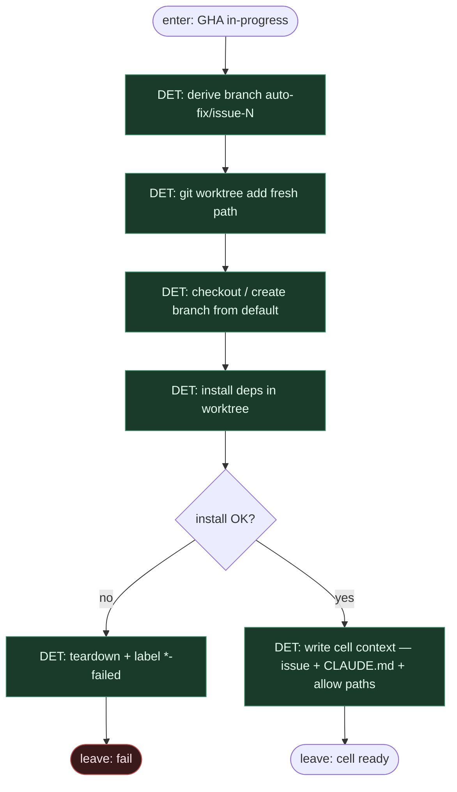

# Subgraph: worktree

**Theme:** fresh `git worktree` + branch + install — sandbox komórka Solvio / ready-for-agent.  
**Mode mix:** 100% DET. Zero LLM w setup komórki.

## Flow

## Notes

- **Reuse fidelity.** Solvio: Node `auto-fix-issue.mjs` + `git worktree`; JBS Phase Prepare = ten sam seat. Worktree obowiązkowy — nie brudny cwd głównego klona.
- **K=1.** Jeden ticket = jeden worktree = jeden branch (`auto-fix/issue-N` albo `fix/issue-N`). Occupancy blokuje drugi claim w gha-dispatch.
- **Kontekst wąski.** Następny liść czyta issue (repro/expected/actual z template JBS) + `CLAUDE.md` + allow paths — nie cały świat i nie historię czatu.
- **Install jest DET.** `pnpm i` / `npm i` / Makefile — skrypt z repo; fail = `*-failed`, nie „agent naprawi środowisko na ślepo”.
- **Cleanup.** Po `*-done` / `*-failed` / timeout: `git worktree remove` + branch GC — DET, nie domysł liścia.
- **Handoff contract.** `{worktree_path, branch, base_sha, issue_payload, allow_paths[]}` albo `{ok:false, reason:install|worktree}`.
