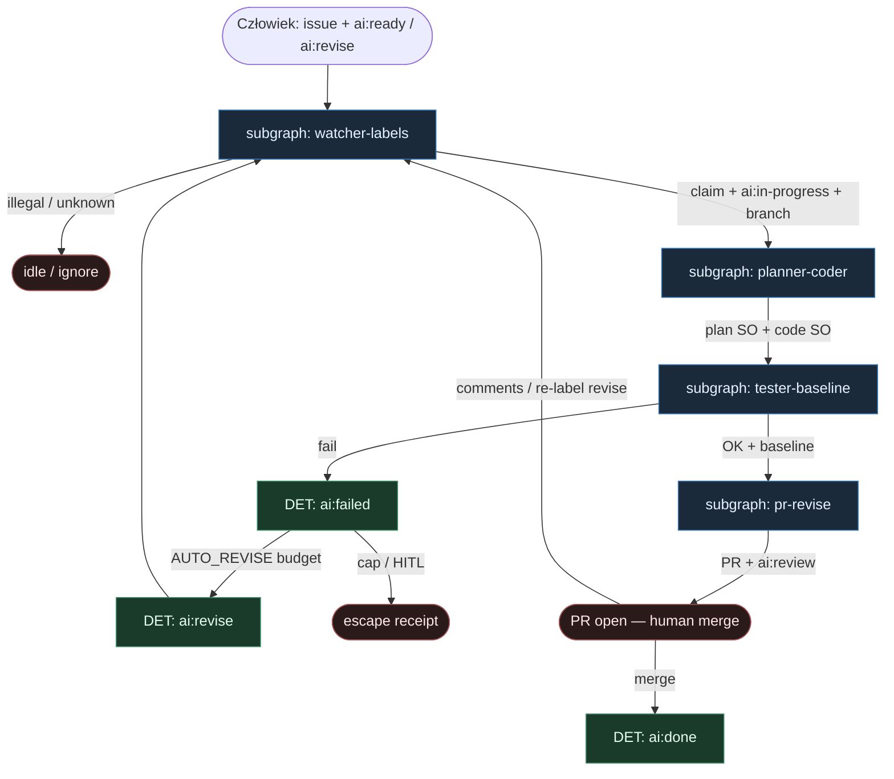

# 35 — Phoenix FSM (Watcher label SM)

**Persona:** `phoenix-fsm compose` — wierność [kkipngenokoech/phoenix](https://github.com/kkipngenokoech/phoenix) (`phoenixgithub`): **Watcher** + label SM **Planner→Coder→Tester→PR**. Stan = etykiety `ai:*`; daemon `watch` / one-shot `run-issue` flipuje; agenty = liście ról.

**Approach:** `compose_phoenix_fsm`. Lokalny watcher (nie GHA-first) jest kręgosłupem DET. Pipeline LLM: Planner → Coder → Tester (+ baseline) → PR Agent; Failure Analyst przy `ai:failed` / `ai:revise`.

## Design notes

- **Impulse = label.** `ai:ready` (pierwszy bieg) albo `ai:revise` (pętla). Zero pick z czatu / unlabeled backlogu.
- **Watcher owns FSM.** `phoenixgithub watch` (albo `run-issue`) czyta event, flipuje `ai:in-progress`, otwiera branch `phoenix/issue-N`, woła role w stałej kolejności, potem `ai:review` / `ai:failed`. Agent **nie** woła `gh label` sam z siebie.
- **Watcher label SM: Planner→Coder→Tester→PR.** To kanoniczna oś wariantu — kolejność sztywna; LLM nie dopisuje etapów.
- **TEST_COMMAND + baseline.** Tester porównuje wynik z baseline; profile `auto` / `python` / `frontend` / `generic`. Fail → `ai:failed` → (cap) `AUTO_REVISE_*` → `ai:revise` → Watcher.
- **Coder ceiling = PR + `ai:review`.** Sukces kończy się otwartym PR i etykietą review — nie merge. `ai:done` po akceptacji człowieka.
- **DET majority.** Watcher, mutex etykiet, branch, baseline gate, flip labels, open PR — skrypt. AGENT tylko w rolach Planner/Coder/Tester/PR/FailureAnalyst.
- **Meat ≡ AI.** To samo siedzenie w liściu; graf bez zmian gdy wypełnia człowiek-klepacz vs LLM.
- **NOT L5.** Ticket→PR klepacz. Nie lights-out bank, nie auto-merge feature’ów, nie wymyślanie ticketów.
- **Cel (SOUL):** człowiek ma energię na review — bo nie spalił dnia na watch→plan→code→test→PR.

## Top-level flowchart

**DET vs AGENT at a glance**

| Warstwa | Mode | Skąd (Phoenix) | Uwaga |
|---------|------|----------------|-------|
| Label `ai:ready` / `ai:revise` | DET impulse | watcher | agent nie wybiera pracy |
| Flip `ai:in-progress` / `ai:review` / `ai:failed` / `ai:done` | DET FSM | Watcher only | owns stages |
| Branch `phoenix/issue-N` | DET | local worktree | K=1 per issue |
| Planner → Coder | AGENT leaves | multi-agent LLM | sztywna kolejność |
| Tester + `TEST_COMMAND` + baseline | DET gate + AGENT leaf | profiles | fail → failed |
| PR Agent + `ai:review` | DET open + AGENT body | ceiling | nie merge |
| `AUTO_REVISE_*` → `ai:revise` | DET loop | capped | Failure Analyst leaf |
| Human merge → `ai:done` | HITL | MergePolicy Off | default |

## Index of subgraphs

| File | Theme | Role in chain |
|------|--------|----------------|
| [subgraph-watcher-labels.md](./subgraph-watcher-labels.md) | Watcher + `ai:*` FSM | DET kręgosłup; owns stages |
| [subgraph-planner-coder.md](./subgraph-planner-coder.md) | Planner → Coder | AGENT leaves w stałej osi |
| [subgraph-tester-baseline.md](./subgraph-tester-baseline.md) | Tester + baseline gate | DET gate wokół leaf |
| [subgraph-pr-revise.md](./subgraph-pr-revise.md) | PR + revise/fail | coder ceiling + escape |

## Mapowanie Phoenix → klepacz

| Phoenix | Klepacz seat |
|---------|--------------|
| `ai:ready` / `ai:revise` | subgraph-watcher-labels impulse |
| `phoenixgithub watch` / `run-issue` | Watcher DET advance |
| `ai:in-progress` + `phoenix/issue-N` | claim + sandbox |
| Planner → Coder | subgraph-planner-coder |
| Tester + baseline / `TEST_COMMAND` | subgraph-tester-baseline |
| PR + `ai:review` | subgraph-pr-revise ceiling |
| `ai:failed` → `ai:revise` | bounded escape loop |
| `ai:done` po merge | HITL MergePolicy Off |
| Agent as FSM router | **FORBIDDEN** |

## Antyteza (czego tu nie ma)

- Agent wybierający pracę z czatu / unlabeled backlogu
- Agent sam flipujący `ai:*` „bo tak wyszło z promptu”
- GHA-first jako jedyny executor (tu kanon = lokalny watcher; GHA opcjonalny mirror)
- Unbounded revise bez `ai:failed` / cap
- Auto-merge bez człowieka
- L5 lights-out / wymyślanie ticketów

## Kryterium sukcesu

Technicznie: branch `phoenix/issue-N` + otwarty PR + `ai:review` (albo czysty `ai:failed` z evidence). Ludzko: inżynier reviewuje i merguje (`ai:done`) — nie babysittował watch→plan→code→test→PR.
