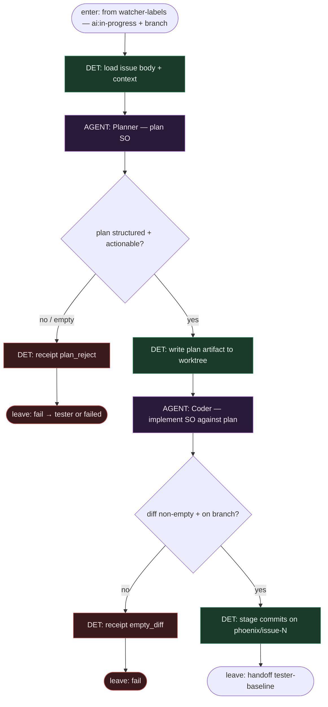

# Subgraph: planner-coder

**Theme:** stała oś **Planner → Coder** (Watcher label SM). Agenty = liście SO; nie flipują labels, nie otwierają PR.  
**Mode mix:** DET orchestracja kolejności + AGENT leaves (Planner, Coder).

## Flow

## Notes

- **SM order is law.** Watcher label SM: **Planner→Coder→Tester→PR**. Coder nie startuje przed planem; Tester nie przed Coderem.
- **Light agents.** Planner tylko planuje (structured output). Coder tylko implementuje względem planu. Żaden nie jest orkiestratorem tool-callingiem całego grafu (SOUL: lekkie, wąskie agenty).
- **DET owns git.** Branch, commit message template, paths allowlist — skrypt. AGENT produkuje diff / pliki.
- **Meat ≡ AI.** Człowiek-klepacz może wypełnić ten sam slot Planner albo Coder bez zmiany krawędzi.
- **Handoff contract.** `{plan_artifact, branch, commit_sha?}` albo `{fail: plan_reject|empty_diff}`.
