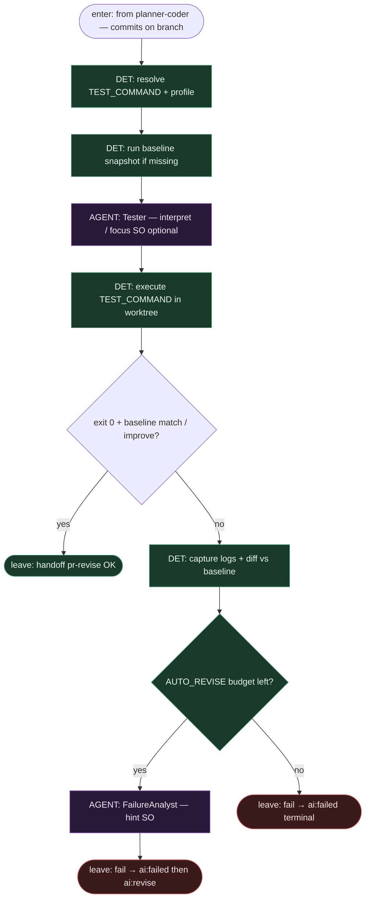

# Subgraph: tester-baseline

**Theme:** **Tester** + `TEST_COMMAND` + porównanie z **baseline**; profile `auto` / `python` / `frontend` / `generic`.  
**Mode mix:** DET gate majority + AGENT leaf (Tester / Failure Analyst hint).

## Flow

## Notes

- **Gate is DET.** Exit code + baseline comparison decydują — nie „Tester powiedział OK w prozie”.
- **Profiles.** `auto` wykrywa stack; `python` / `frontend` / `generic` mapują na typowe komendy (env `TEST_COMMAND` wygrywa).
- **Bounded revise.** `AUTO_REVISE_*` = budget; wyczerpanie → `ai:failed` bez kolejnego `ai:revise` (circuit breaker).
- **Failure Analyst = leaf.** Hint do kolejnego Planner/Coder; nie flipuje labels.
- **Handoff contract.** `{ok: true, test_log}` albo `{ok: false, evidence, revise: bool}`.
