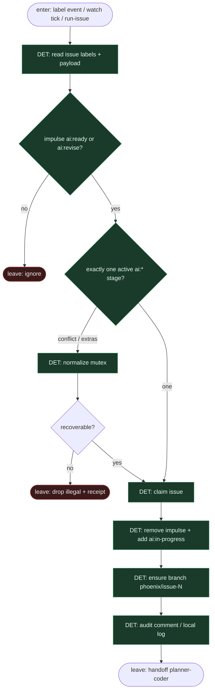

# Subgraph: watcher-labels

**Theme:** lokalny **Watcher** (`phoenixgithub watch` / `run-issue`) + etykiety `ai:*` = stany FSM; Watcher owns stages.  
**Mode mix:** 100% DET. Zero AGENT w kręgosłupie.

## Flow

## Transition table (compose Phoenix)

| From | Event / predicate | To | Who flips |
|------|-------------------|----|-----------|
| *(human)* | label `ai:ready` | claim → `ai:in-progress` | Watcher |
| *(human / loop)* | label `ai:revise` | claim → `ai:in-progress` | Watcher |
| `ai:in-progress` | Planner→Coder→Tester OK | handoff PR → `ai:review` | Watcher |
| `ai:in-progress` | test/agent fail | `ai:failed` | Watcher |
| `ai:failed` | `AUTO_REVISE` budget left | `ai:revise` | Watcher |
| `ai:failed` | cap / HITL | stay failed + receipt | Watcher |
| `ai:review` | human merge | `ai:done` | człowiek (+ optional script) |
| `*` | illegal multi-stage | normalize or drop | Watcher |

## Notes

- **Reuse fidelity.** Phoenix README: impulse `ai:ready` / `ai:revise` → Watcher `ai:in-progress` → pipeline → `ai:review` / `ai:failed` → revise loop → human `ai:done`.
- **Watcher owns FSM.** Stan żyje na issue labels — nie w pamięci agenta, nie w czacie. Executor = lokalny daemon/CLI (GHA mirror opcjonalny, nie kanon).
- **Agent never routes.** Role zwracają enum wyniku (`ok`/`fail`/`defer`); Watcher mapuje na tabelę. Poza tabelą = `ai:failed` albo ignore.
- **Mutex.** Jedna aktywna stage-label `ai:*` naraz; extras strip przed claim.
- **Handoff contract.** `{stage: in_progress, issue_id, branch: phoenix/issue-N}` albo `{ignore|drop}`.
