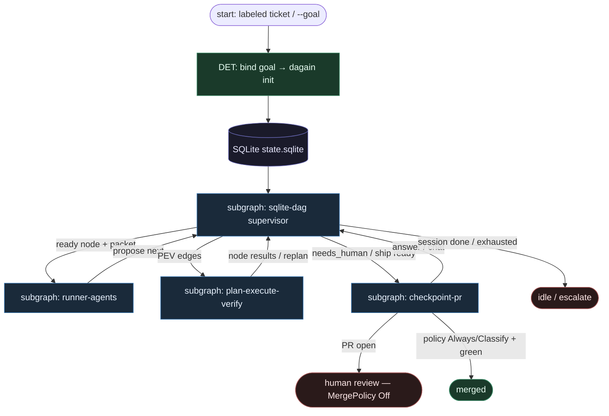

# 36 — Knot DAG / dagain (compose)

**Persona:** knot-dag compose — **SQLite DAG executor** owns plan / execute / verify; **agents are runners** (propose-only, fresh packets). HITL = `needs_human` checkpoint; coder ceiling = PR.

**Approach:** compose. Mapowanie [knot0-com/dagain](https://github.com/knot0-com/dagain) ([docs](https://knot0.com/writing/dagain)) na duszę klepacza: ticket/goal → przetestowany PR, **nie** L5 lights-out, **nie** chat-thread jako pamięć.

## Design notes

- **SQLite jest pamięcią i programem.** `.dagain/state.sqlite` (`nodes`, `deps`, `kv_latest`, `kv_history`, `mailbox`) = source of truth. Crash → restart z pliku, nie z context window.
- **Executor / supervisor jest DET.** On wybiera gotowe węzły (deps OK), odpala runnerów, **parsuje propozycje** i **aplikuje** `setStatus` / `addNodes`. Zero LLM w schedulerze i w apply.
- **Agents = runners.** Codex / Claude / Gemini (role pools) dostają **świeży packet** (goal + artefakty deps) i zwracają structured result. Nie mutują grafu bezpośrednio; nie oznaczają się „done”.
- **Plan → execute → verify → integrate** to **węzły w DAGu**, nie fazy w głowie orkiestratora. Fail node → retry policy → escalate do najbliższego plan → replan; po limicie → `checkpoint` / escalate.
- **Fresh context, every time.** Przeciwieństwo „długiego chatu”: każdy węzeł = nowy proces + chirurgiczny packet. `$DAGAIN_DB` / `$DAGAIN_NODE_ID` = wskaźniki, nie transcript SoT.
- **Runner pools / promotion.** Tanie runnerzy najpierw; promote on timeout / missing_result / spawn_error. Koszt ↓, eskalacja gdy trzeba.
- **Parallel + worktrees.** `--workers N`; niezależne węzły równolegle; konfliktogenne edity → worktree mode; merge sekwencyjny.
- **Klepacz bridge.** Trigger = labeled `ready-for-agent` **→** `goal` (issue title/body) **→** `dagain init` / bind sesji. Cel sesji = **jeden** ticket → **jeden** PR (K=1).
- **Meat ≡ AI w runner seat.** To samo siedzenie / ten sam schema; supervisor nie rozróżnia.
- **NOT L5.** Zdjąć wyczerpujące klepanie (plan drift, babysit, zapominanie celu); człowiek zostaje przy checkpointach, architekturze i review merge.
- **Coder ceiling = open PR.** Integrator / `create-pr` kończy fabrykę; MergePolicy domyślnie **Off**.

## Top-level flowchart

**DET vs AGENT at a glance**

| Layer | Mode | Responsibility |
|-------|------|----------------|
| `init` / goal↔ticket bind | DET | Seed SQLite nodes + deps |
| SQLite supervisor schedule + apply | DET | Pick ready, apply proposals, mailbox |
| Runner packet build | DET | Fresh context file per node |
| plan / execute / verify / integrate runners | AGENT (runner) | Propose status + optional addNodes |
| retry / escalate-to-plan | DET policy | Failure first-class; bounded |
| `needs_human` checkpoint | HITL | `dagain answer` / chat — recorded |
| create-pr / integrator | DET (+ thin runner leaf) | Coder ceiling |
| Human PR review / MergePolicy | HITL / DET policy | Default Off |

## Index of subgraphs

| File | Theme | Role in chain |
|------|--------|----------------|
| [subgraph-sqlite-dag.md](./subgraph-sqlite-dag.md) | SQLite SoT + supervisor apply | DET spine / executor |
| [subgraph-runner-agents.md](./subgraph-runner-agents.md) | Fresh packet + propose-only | Jedyny sink LLM |
| [subgraph-plan-execute-verify.md](./subgraph-plan-execute-verify.md) | plan→execute→verify(+integrate) | Role nodes w DAGu |
| [subgraph-checkpoint-pr.md](./subgraph-checkpoint-pr.md) | needs_human → PR ceiling | HITL + merge Off |

## Compose map (dagain → klepacz)

| dagain concept | Klepacz seat |
|----------------|--------------|
| `dagain init --goal` | labeled issue → goal string / bind ticket_id |
| `.dagain/state.sqlite` | checkpoint misji; inspectable SoT |
| Supervisor schedule + apply | daemon tick / fixed executor (nie department brain) |
| Runner roles (plan/executor/verifier/integrator) | thin runners; meat≡AI |
| Structured `next` proposals | SO contract; never direct graph mutate |
| Fresh packet / env `$DAGAIN_*` | surgical context; no chat SoT |
| Retry → escalate to plan | bounded repair / replan |
| `checkpoint` / `needs_human` | HITL answer recorded in SQLite |
| Runner pool promotion | cost ladder; not fat orchestrator |
| Worktrees + workers | optional parallel; K=1 default for klepacz |
| Integrator / session done | open `ai/…` PR; MergePolicy **Off** |
| LLM choosing next DAG edge | **FORBIDDEN** (supervisor owns) |
| Goal mill bez ticket queue | mostek gh issue → goal — wymagany |

## Antyteza (czego tu nie ma)

- Agent jako router grafu / „co dalej w DAG”
- Długi transcript jako pamięć misji
- Runner mutujący SQLite / self-done bez apply
- Nieskończony replan bez checkpoint / escalate
- Auto-merge z wewnątrz integratora
- L5 lights-out / discovery ticketów z czatu
- Jeden gruby mózg tool-calling orkiestrujący całość

## Kryterium sukcesu

Człowiek ma energię na architekturę i niewygodne pytania — bo SQLite + supervisor zdejmują klepanie i goal-drift. Technicznie: `state.sqlite` prowadzi do otwartego `ai/…` PR na tipie hosta; LLM nigdy nie aplikuje zmian grafu ani nie wybiera batcha.
