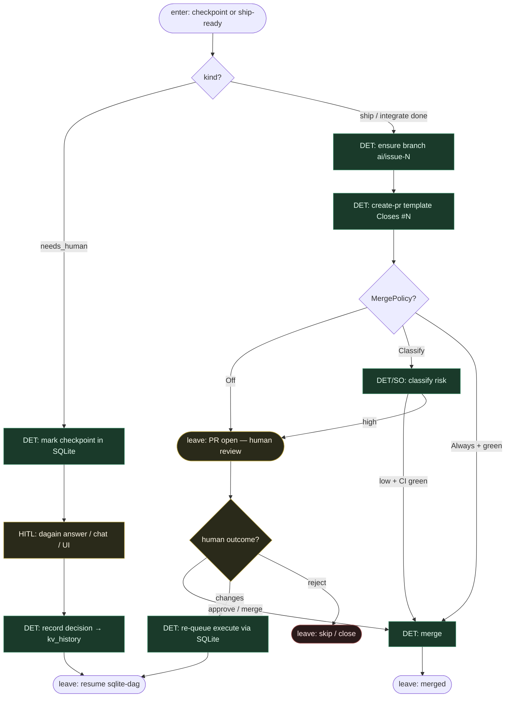

# Subgraph: checkpoint-pr

**Theme:** `needs_human` checkpoint + coder ceiling = open PR; MergePolicy Off.  
**Mode mix:** HITL + DET PR atoms; opcjonalny cienki runner na body/docs.

## Flow

## Notes

- **Checkpoint is durable.** Decyzja człowieka w SQLite — no re-asking, no context loss (dagain model).
- **Chat ≠ orchestrator.** `dagain chat` czyta tę samą bazę (status/pause/inject); nie zastępuje supervisor apply.
- **Coder ceiling = open PR.** Zgodnie z duszą: zdjąć klepanie do PR; merge = wartość ludzka / polityka.
- **Default MergePolicy = Off.** Classify/Always = jawne warianty DET na hoście klepacza.
- **K=1.** Jedna sesja / jeden goal / jeden PR; supervisor nie sieje katalogu feature’ów.
- **Handoff contract.** Checkpoint = `{node_id, question, answer?, state: waiting|resolved}`; PR = `{pr_url, number, head, merge_policy, state}`.
