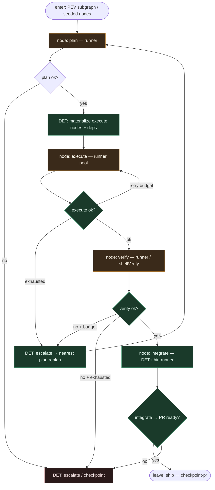

# Subgraph: plan-execute-verify

**Theme:** role **plan → execute → verify → integrate** jako węzły DAG (nie fazy w LLM-orkiestratorze).  
**Mode mix:** AGENT w liściach ról; DET edges / retry / escalate-to-plan.

## Flow

## Notes

- **SQLite executor owns PEV.** „Owns plan/execute/verify” = supervisor trzyma pętlę i edges; runners tylko wypełniają węzły.
- **Plan is a node.** Replan = nowy / zresetowany plan node + history w `kv_history` — nie „agent zmienił zdanie w chacie”.
- **Execute may fan-out.** Niezależne implement nodes OK; klepacz default K=1 / wąski łańcuch.
- **Verify first-class.** `shellVerify` / test command z planu; fail → retry → escalate-to-plan (dagain failure model), nie ciche „napraw świat”.
- **Integrate ≠ merge.** Integrator składa artefakty / otwiera PR; merge zostaje HITL / MergePolicy.
- **Reviewer ≠ implementer.** Opcjonalny `pr_review` runner przed integrate — osobne siedzenie.
- **Handoff contract.** Pass = `{phase, node_id, artefacts[], verify: ok}`; replan = `{reset_to: plan_id, reason}`; exhaust = `{ok:false, reason: "pev_exhausted"}`.
