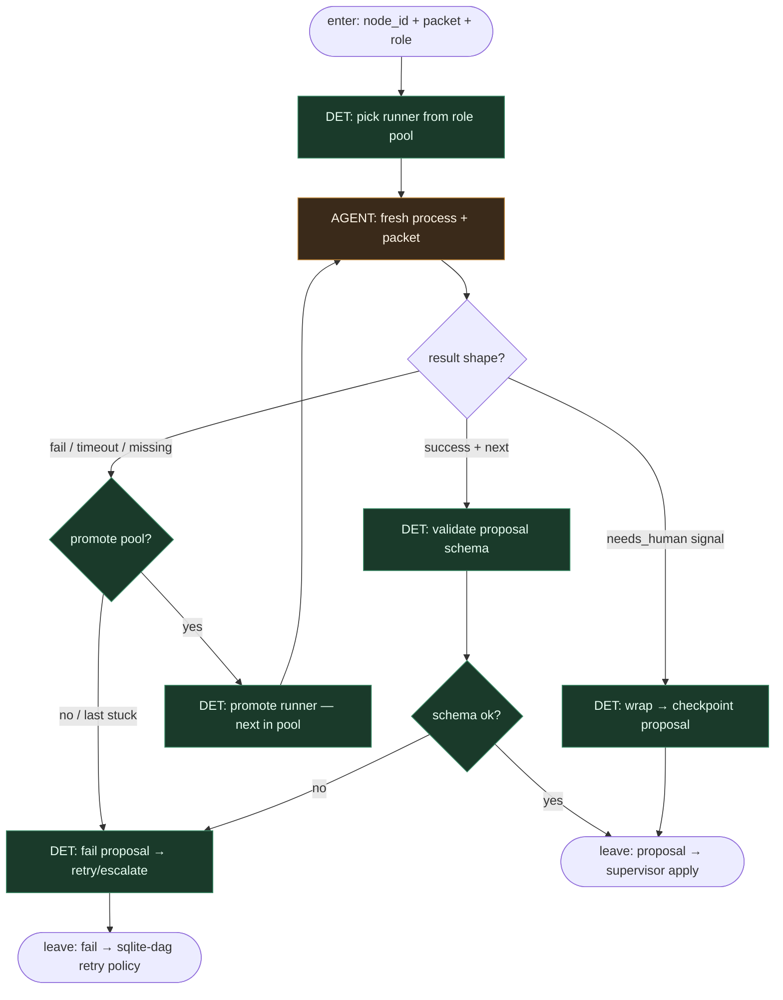

# Subgraph: runner-agents

**Theme:** agenty jako **runners** — świeży packet, structured propose; **zero** mutacji grafu.  
**Mode mix:** AGENT runners only. Supervisor / SQLite apply = poza tym podgrafem.

## Flow



## Notes

- **Propose, don't apply.** Canonical shape (dagain-style):
  ```json
  {
    "status": "success",
    "next": {
      "setStatus": [{"id": "task-001", "status": "done"}],
      "addNodes": [{"id": "task-002", "title": "Add tests"}]
    }
  }
  ```
- **Fresh packet every time.** Goal + decyzje deps + artefakty — chirurgicznie. Brak narastającego chatu jako SoT.
- **Role pools.** np. `executor: [codexMedium, codex, claude]` — promotion on timeout / missing_result / spawn_error; cheap-first.
- **Runner ≠ orchestrator.** Nie wybiera „co dalej w całym DAGu”; może *proponować* `addNodes`, ale supervisor decyduje o apply.
- **Meat ≡ AI.** Człowiek może wypełnić ten sam packet/schema; pool entry „human” OK.
- **ok:false bez limbo.** `underspecified | too_large | dangerous | cant_comply` → fail proposal → sqlite escalate / skip.
- **Handoff contract.** `{node_id, proposal, runner_id, attempts, ok}` albo `{ok:false, reason, promote?}`.
