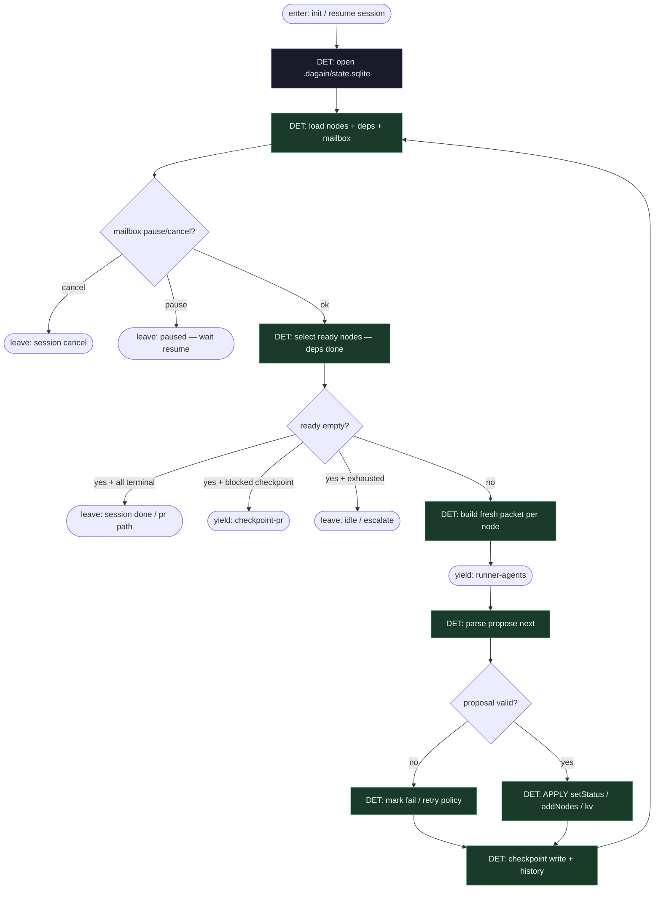

# Subgraph: sqlite-dag

**Theme:** SQLite DAG = źródło prawdy; supervisor / executor **DET** — schedule + apply, zero LLM.  
**Mode mix:** 100% DET. Runners tylko yield.

## Flow

## Notes

- **Graph-is-SQLite.** Topologia i stan żyją w tabelach — nie w prompcie „zrób następny krok”.
- **Supervisor owns the loop.** Wybór ready, apply, retry counters, mailbox — wyłącznie DET.
- **Apply is load-bearing.** Runner nigdy nie pisze `nodes.status` sam; tylko propozycja → walidacja → apply + `kv_history`.
- **Inspectable.** `sqlite3 .dagain/state.sqlite "SELECT * FROM nodes"` = debug; brak Redis/sofy zewnętrznej.
- **Klepacz bind.** Seed nodes: `plan_issue`, `implement` (+ opc. breakdown), `verify`, `integrate_pr`, `checkpoint_review` — nie feature-mill catalogue.
- **Handoff contract.** Yield = `{node_ids[], packet_paths[], session_id}`; resume = `{node_id, proposal, runner_id, ok}` → apply result `{applied|rejected, reason?}`.
