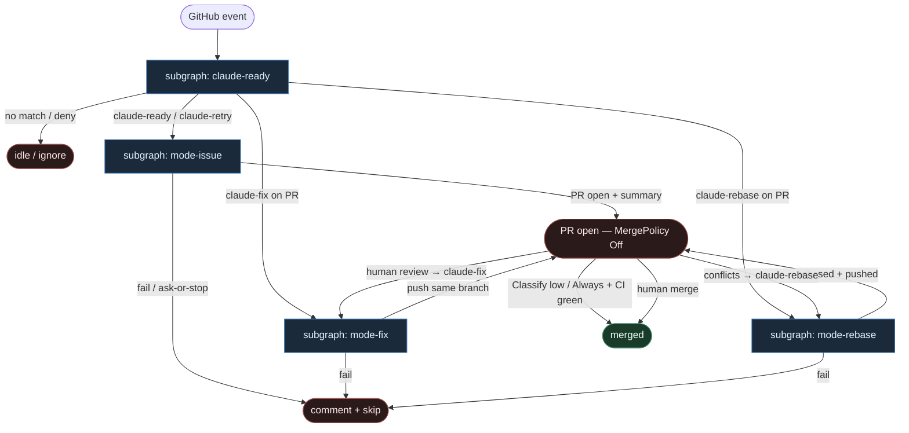

# 37 — Hue Issue2Claude Action reuse

**Persona:** `hue-action-reuse` — maksymalna wierność [lennystepn-hue/issue2claude](https://github.com/lennystepn-hue/issue2claude) (Marketplace [Issue2Claude](https://github.com/marketplace/actions/issue2claude)): **`claude-ready` → fixed GHA modes `issue` | `fix` | `rebase` → PR**. Agenty są **liśćmi**.

**Approach:** `reuse_ready`. Nie wymyślamy orkiestratora — bierzemy Marketplace Action z trzema stałymi jobami `mode:` i rozkładamy na podgrafy DET-majority zgodne z SOUL / KLEPACZ.

## Design notes

- **`claude-ready` = start.** `issues.labeled` gdy etykieta `claude-ready`; retry komentarzem `claude-retry` na issue (nie PR). Zero agent pick z czatu / unlabeled backlogu.
- **Fixed modes = spine.** Trzy joby GHA z sztywnym `mode:` — `issue` / `fix` / `rebase`. `if:` na evencie + tokenie komentarza wybiera job; LLM **nie** wybiera trybu.
- **`lennystepn-hue/issue2claude@main` = liść.** Entropy tylko wewnątrz action (implement / apply feedback / resolve conflicts). Action nie flipuje stage-labeli fabryki ani merge policy.
- **Issue mode:** indeks/kontekst → Claude Code implementuje → auto-review → otwiera PR + summary.
- **Fix mode:** komentarz `claude-fix` na PR → czyta review comments → push na ten sam branch.
- **Rebase mode:** komentarz `claude-rebase` na PR z konfliktami → rebase + inteligentne rozwiązanie → push.
- **Coder ceiling = open PR.** Action + GHA dochodzą do PR. Merge = polityka DET / człowiek (domyślnie **Off**).
- **DET majority.** Trigger parse, `if:` guards, checkout `fetch-depth: 0`, setup-node, `npm i -g @anthropic-ai/claude-code`, secrets wiring — skrypty / GHA. AGENT tylko w liściu action per mode.
- **Meat ≡ AI.** To samo siedzenie w łańcuchu; graf się nie zmienia gdy liść wypełnia człowiek-klepacz vs model.
- **NOT L5.** Zdejmujemy babysitting label→PR / fix / rebase w CI runnerze. Nie lights-out bank.
- **Cel (SOUL):** człowiek ma energię na architekturę — bo nie spalił dnia na ticket→branch→push→PR→konflikty.

## Top-level flowchart

**DET vs AGENT at a glance**

| Layer | Mode | Skąd (reuse) | Uwaga |
|-------|------|--------------|-------|
| `claude-ready` / `claude-retry` / `claude-fix` / `claude-rebase` | DET | GHA `on:` + `if:` | agent nie wybiera pracy ani trybu |
| checkout, setup-node, claude-code install | DET | fixed workflow YAML | spine bez LLM |
| `issue2claude@main` `mode: issue` | AGENT leaf | Marketplace action | implement + auto-review + PR |
| `mode: fix` | AGENT leaf | PR comment token | feedback → same branch |
| `mode: rebase` | AGENT leaf | PR comment token | konflikty → push |
| open PR / hold | DET | action follow-up | coder ≠ merge |
| Merge Off\|Classify\|Always | DET policy | KLEPACZ / ready-for-agent | default Off |

## Index of subgraphs

| File | Theme | Role in chain |
|------|--------|----------------|
| [subgraph-claude-ready.md](./subgraph-claude-ready.md) | label / comment tokens | DET trigger + mode route |
| [subgraph-mode-issue.md](./subgraph-mode-issue.md) | `mode: issue` | implement → auto-review → PR |
| [subgraph-mode-fix.md](./subgraph-mode-fix.md) | `mode: fix` | PR feedback loop leaf |
| [subgraph-mode-rebase.md](./subgraph-mode-rebase.md) | `mode: rebase` | conflict resolve leaf |

## Mapowanie Issue2Claude → klepacz

| Issue2Claude / GHA | Klepacz seat |
|--------------------|--------------|
| `on: issues.labeled` `claude-ready` | subgraph-claude-ready |
| `claude-retry` on issue comment | subgraph-claude-ready → mode-issue |
| job `mode: issue` | subgraph-mode-issue (AGENT leaf) |
| `claude-fix` on PR comment | subgraph-mode-fix (AGENT leaf) |
| `claude-rebase` on PR comment | subgraph-mode-rebase (AGENT leaf) |
| open PR + summary | coder ceiling (DET) |
| human merge / policy | MergePolicy Off (default) |
| agent as workflow / mode router | **FORBIDDEN** |

## Antyteza (czego tu nie ma)

- Agent wybierający pracę z czatu / unlabeled backlogu
- LLM wybierający `mode:` (`issue` vs `fix` vs `rebase`)
- Monolit: merge wewnątrz action jako jedyna ścieżka
- L5 lights-out / wymyślanie ticketów
- Współdzielony dirty tree poza runnerem (runner = świeża komórka)

## Kryterium sukcesu

Technicznie: otwarty (opc. zmergowany) PR z issue oznaczonego `claude-ready`; fix/rebase domykają pętlę bez ręcznego konfliktu. Ludzko: inżynier nie babysittował label→PR→fix→rebase — energia na architekturę i niewygodne pytania QA.
