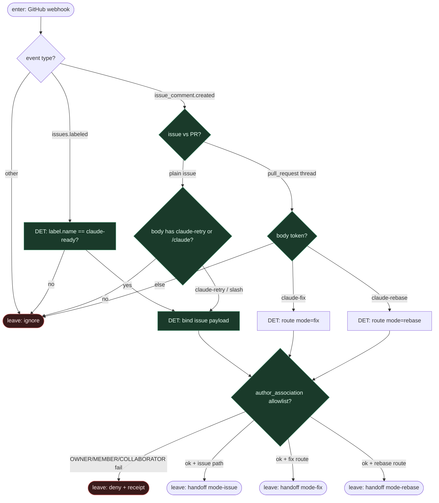

# Subgraph: claude-ready

**Theme:** etykieta `claude-ready` / tokeny komentarza = jedyny start + DET route do stałego `mode:`.  
**Mode mix:** 100% DET. Agent nie wybiera pracy ani trybu (`issue` / `fix` / `rebase`).

## Flow

## Notes

- **Reuse fidelity.** Issue2Claude aktywuje się z `claude-ready`, `claude-retry`, `claude-fix`, `claude-rebase` (oraz slash `/claude …`) — nie z „agent przeszukał backlog”.
- **Mode route = DET.** Ten sam podgraf tylko *klasyfikuje event* na stały job `mode:`; model nigdy nie wybiera `issue` vs `fix` vs `rebase`.
- **Allowlist association.** Workflow dogfood wymaga OWNER / MEMBER / COLLABORATOR na komentarzach — fail closed poza listą.
- **K=1 hint.** Handoff niesie jeden `issue_id` / `pr_number`; occupancy (live run na tym samym ticket) może zablokować claim w jobie.
- **Handoff contract.** `{issue_id|pr_number, trigger, mode: issue|fix|rebase, actor}` albo `{ignore|deny}`.
