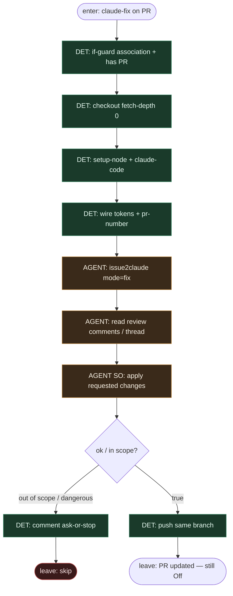

# Subgraph: mode-fix

**Theme:** stały job GHA `mode: fix` — komentarz `claude-fix` na PR → zastosuj feedback → push na ten sam branch.  
**Mode mix:** DET harness + AGENT leaf (`mode: fix`).

## Flow

## Notes

- **Reuse fidelity.** Marketplace: „Claude reads your review comments and applies the changes — then pushes to the same branch.”
- **Same branch = K=1.** Fix nie otwiera nowego PR; coder ceiling nadal „PR open”, nie merge.
- **Token, nie LLM-router.** Obecność `claude-fix` w body wybiera ten job w YAML `if:` — model nie decyduje „wejść w fix mode”.
- **Bounded.** Poza Allowed / auth / billing / migracje → ask-or-stop, nie „ulepsz po drodze”.
- **Handoff contract.** `{pr_number, branch, shas[]}` \| `{skip, reason}`.
