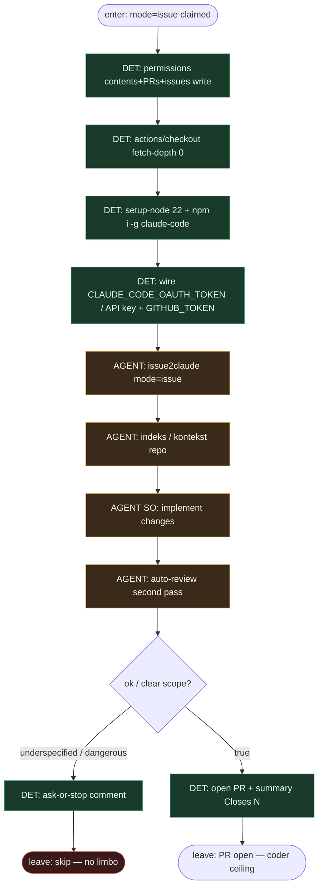

# Subgraph: mode-issue

**Theme:** stały job GHA `mode: issue` — implementacja issue → auto-review → otwarty PR.  
**Mode mix:** DET harness + AGENT leaf `lennystepn-hue/issue2claude` (`mode: issue`).

## Flow

## Fixed step table (compose)

| # | Step | Who | Notes |
|---|------|-----|-------|
| 1 | `if:` claude-ready / claude-retry | DET | z claude-ready subgraph |
| 2 | `permissions:` write trio | DET | contents / pull-requests / issues |
| 3 | `actions/checkout@v4` `fetch-depth: 0` | DET | świeża komórka = worktree |
| 4 | setup-node + `@anthropic-ai/claude-code` | DET | jak w ghostclip workflow |
| 5 | `issue2claude@main` `mode: issue` | AGENT leaf | implement + auto-review |
| 6 | open PR + summary | DET / action | coder ceiling; merge Off |

## Notes

- **YAML is the program.** `mode: issue` jest stałe w jobie — nie „zdecyduj tryb w promptcie”.
- **Auto-review = drugi pass w liściu.** Nadal AGENT entropy *wewnątrz* action; nie osobny orkiestrator merge.
- **Runner = fresh cell.** Efekt fresh worktree: czysty checkout per run, K=1 na ticket.
- **Meat ≡ AI.** To samo siedzenie: headless Claude w action albo człowiek-klepacz w tym samym runner contract.
- **Handoff contract.** `{pr_url, number, branch, summary}` \| `{skip, reason}`.
