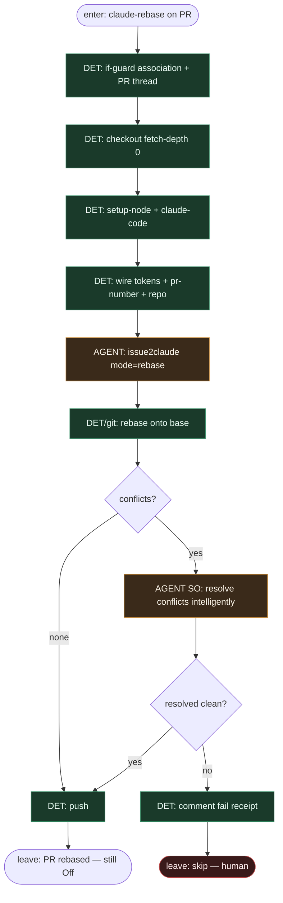

# Subgraph: mode-rebase

**Theme:** stały job GHA `mode: rebase` — komentarz `claude-rebase` na PR z konfliktami → rebase + resolve → push.  
**Mode mix:** DET harness + AGENT leaf (`mode: rebase`).

## Flow

## Notes

- **Reuse fidelity.** Marketplace: „Comment `claude-rebase` on a PR with merge conflicts. Claude rebases the branch, resolves conflicts intelligently, and pushes.”
- **fetch-depth: 0.** Wymagane do sensownego rebase — DET w spine, nie „agent sam zgaduje historię”.
- **Liść, nie merge.** Rebase + push kończy na zaktualizowanym PR; MergePolicy nadal Off domyślnie.
- **Fail closed.** Nierozwiązywalne / niebezpieczne konflikty → comment + human, nie force-merge z liścia.
- **Handoff contract.** `{pr_number, branch, rebase_ok: true}` \| `{skip, reason}`.
