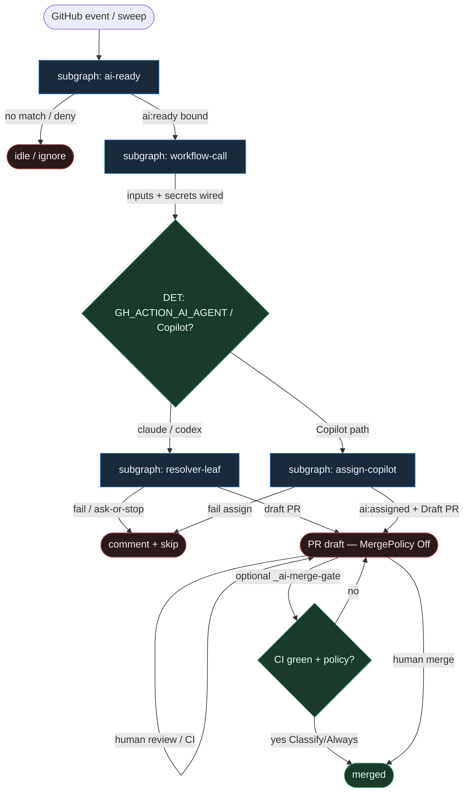

# 38 — dryvist GHA compose (`ai:ready` → resolver/assign)

**Persona:** `dryvist-gha compose` — maksymalna wierność [dryvist/ai-workflows](https://github.com/dryvist/ai-workflows): **reusable `workflow_call`** + kontrakt etykiety **`ai:ready` → stałe kroki resolver / assign**. Agenty (Claude / Codex / Copilot Coding Agent) są **liśćmi**.

**Approach:** `compose`. Nie budujemy monolitu fabryki — składamy bibliotekę importowalnych workflowów GHA (caller w repo konsumenckim + reusable YAML w `dryvist/ai-workflows`) na podgrafy DET-majority zgodne z SOUL / KLEPACZ.

## Design notes

- **`ai:ready` = start.** `issues.labeled` gdy etykieta `ai:ready` (np. `tofu-proxmox`, `nix-ai`); opcjonalnie weekly `issue-backlog-sweep` nakłada `ai:ready`. Zero agent pick z czatu / unlabeled backlogu.
- **Reusable `workflow_call` = spine.** Caller w konsumencie ma cienki `on:` + `uses: dryvist/ai-workflows/.github/workflows/….yml@…`. Kolejność kroków w reusable YAML jest **stała**; LLM nie dopisuje `steps:`.
- **Fixed resolver / assign.** Fork ścieżki wybiera **konfig DET** (`GH_ACTION_AI_AGENT` = claude|codex **albo** workflow Copilot assign) — nie model. Dwie równoległe gałęzie liścia, obie z fixed steps.
- **Resolver leaf:** adapter `run-ai-agent` / `cc-issue-resolver` → Claude (`GH_ACTION_AI_API_KEY`) lub Codex (`OPENAI_API_KEY`) → draft PR.
- **Assign leaf:** `ai:ready` → assign Copilot Coding Agent → flip `ai:assigned` → bot otwiera Draft PR (DET label/assign; entropy u bota).
- **Coder ceiling = draft PR.** Merge domyślnie człowiek; opcjonalny `_ai-merge-gate.yml` to gate, nie lights-out.
- **DET majority.** Label parse, `workflow_call` inputs, secrets wiring, assign/label flip, CI-fix obok — skrypty / GHA. AGENT tylko w resolverze / u Copilota.
- **Meat ≡ AI.** To samo siedzenie w łańcuchu; graf się nie zmienia gdy liść wypełnia człowiek-klepacz vs model.
- **NOT L5.** Suite AI-ops (triage, sweeper, CI-fix) + ścieżka ticket→PR. Nie „godark”, nie wymyślanie ticketów.
- **Cel (SOUL):** człowiek ma energię na architekturę — bo nie spalił dnia na ticket→branch→push→PR.

## Top-level flowchart

**DET vs AGENT at a glance**

| Layer | Mode | Skąd (compose) | Uwaga |
|-------|------|----------------|-------|
| `ai:ready` / sweep | DET | GHA `on:` + label contract | agent nie wybiera pracy |
| caller `workflow_call` | DET | consumer YAML | cienki trigger |
| reusable workflow steps | DET | `dryvist/ai-workflows` | spine bez LLM |
| fork claude\|codex\|copilot | DET | env / which workflow | nie LLM |
| `cc-issue-resolver` / `run-ai-agent` | AGENT leaf | Claude or Codex | entropy tylko tu |
| Copilot assign + `ai:assigned` | DET + bot leaf | assign workflow | label flip DET |
| draft PR / hold | DET | resolver / bot follow-up | coder ≠ merge |
| Merge Off\|Classify\|Always | DET policy | KLEPACZ + opc. merge-gate | default Off |

## Index of subgraphs

| File | Theme | Role in chain |
|------|--------|----------------|
| [subgraph-ai-ready.md](./subgraph-ai-ready.md) | label `ai:ready` (+ sweep) | DET trigger gate |
| [subgraph-workflow-call.md](./subgraph-workflow-call.md) | reusable `workflow_call` | DET fixed spine |
| [subgraph-resolver-leaf.md](./subgraph-resolver-leaf.md) | Claude/Codex resolver | AGENT leaf → draft PR |
| [subgraph-assign-copilot.md](./subgraph-assign-copilot.md) | Copilot assign path | DET assign + bot leaf |

## Mapowanie dryvist/ai-workflows → klepacz

| dryvist / GHA | Klepacz seat |
|---------------|--------------|
| `issues.labeled` `ai:ready` | subgraph-ai-ready |
| `issue-backlog-sweep` → `ai:ready` | subgraph-ai-ready (optional) |
| consumer `issue-auto-resolve.yml` caller | subgraph-workflow-call |
| `uses: …/cc-issue-resolver.yml` / `run-ai-agent` | subgraph-workflow-call → resolver-leaf |
| `GH_ACTION_AI_AGENT` claude\|codex | DET fork → resolver-leaf |
| Copilot `copilot-issue-resolve.yml` | subgraph-assign-copilot |
| `ai:assigned` flip | subgraph-assign-copilot (DET) |
| draft PR | coder ceiling |
| `_ai-merge-gate.yml` / human | MergePolicy Off (default) |
| agent as workflow router | **FORBIDDEN** |

## Antyteza (czego tu nie ma)

- Agent wybierający pracę z czatu / unlabeled backlogu
- LLM wybierający „resolver vs Copilot” albo dopisujący kroki YAML
- Monolit: merge wewnątrz resolvera jako jedyna ścieżka
- L5 lights-out / wymyślanie ticketów
- Jeden „godark” zamiast biblioteki `workflow_call`

## Kryterium sukcesu

Technicznie: po `ai:ready` — draft PR z resolvera (Claude/Codex) **albo** Copilot assign + `ai:assigned` + Draft PR; merge świadomy (człowiek / opc. gate). Ludzko: inżynier nie babysittował ticket→PR w runnerze — energia na architekturę i niewygodne pytania QA.
