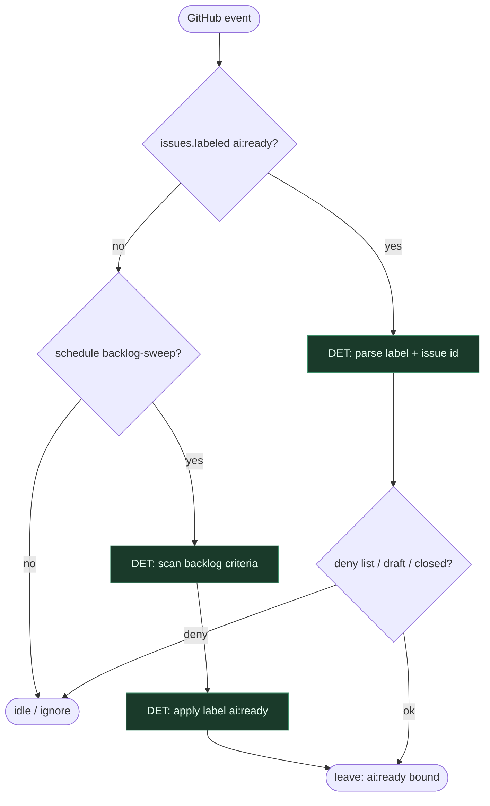

# Subgraph: ai-ready

**Theme:** Etykieta `ai:ready` (+ opcjonalny sweep) = jedyny start.  
**Mode mix:** 100% DET.

## Flow

## Notes

- **Label is the ticket pick.** Agent nie wybiera z unlabeled backlogu.
- **Sweep tylko nakłada etykietę** — nie implementuje.
- **Handoff:** `{issue_number, repo, label=ai:ready}` → workflow-call.
