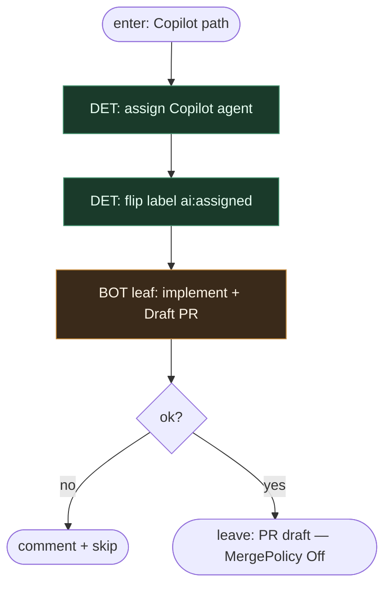

# Subgraph: assign-copilot

**Theme:** `ai:ready` → assign Copilot Coding Agent → `ai:assigned` → Draft PR.  
**Mode mix:** DET label/assign + bot leaf.

## Flow

## Notes

- **Assign/label flip = DET.** Bot = entropy leaf.
- **Opcjonalny `_ai-merge-gate`** to gate, nie lights-out (default Merge Off).
- **Handoff:** draft PR URL + issue id.
