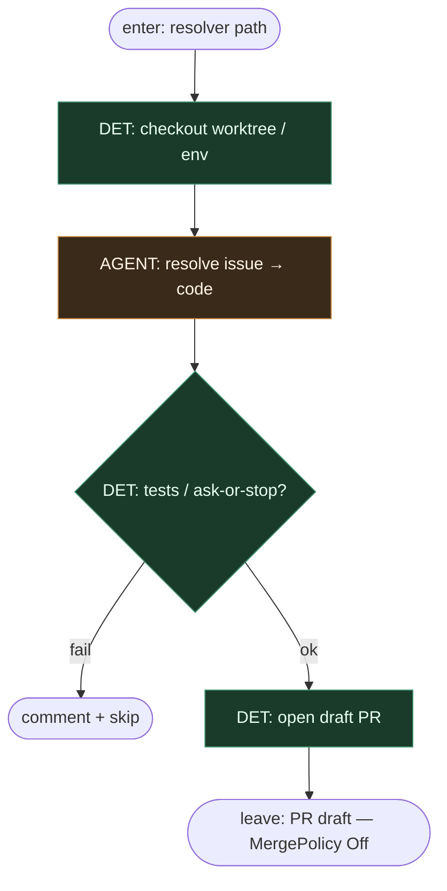

# Subgraph: resolver-leaf

**Theme:** Claude/Codex jako liść `cc-issue-resolver` / `run-ai-agent` → draft PR.  
**Mode mix:** DET harness + AGENT leaf.

## Flow

## Notes

- **Entropy tylko w liściu.** Harness = claim/worktree/PR.
- **Coder ceiling = draft PR**, nie merge.
- **Meat ≡ AI** — to samo siedzenie gdy człowiek wypełnia liść.
