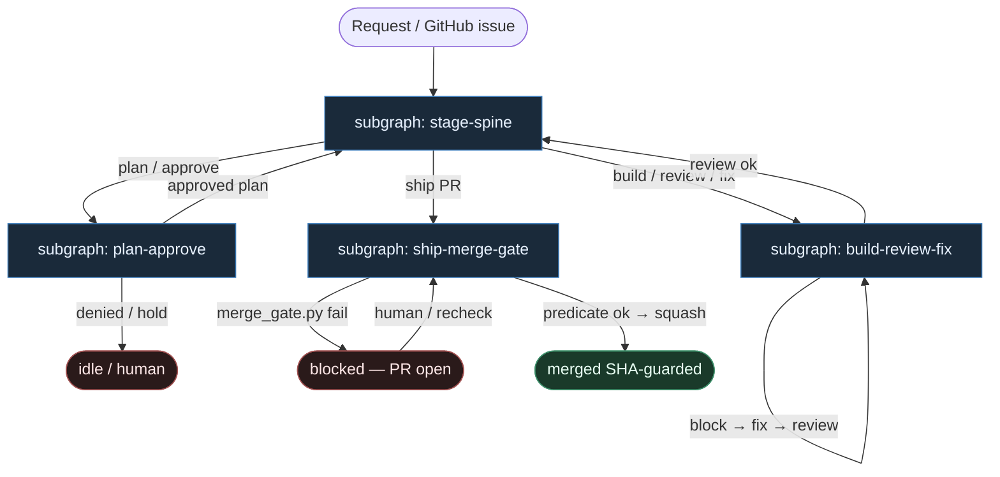
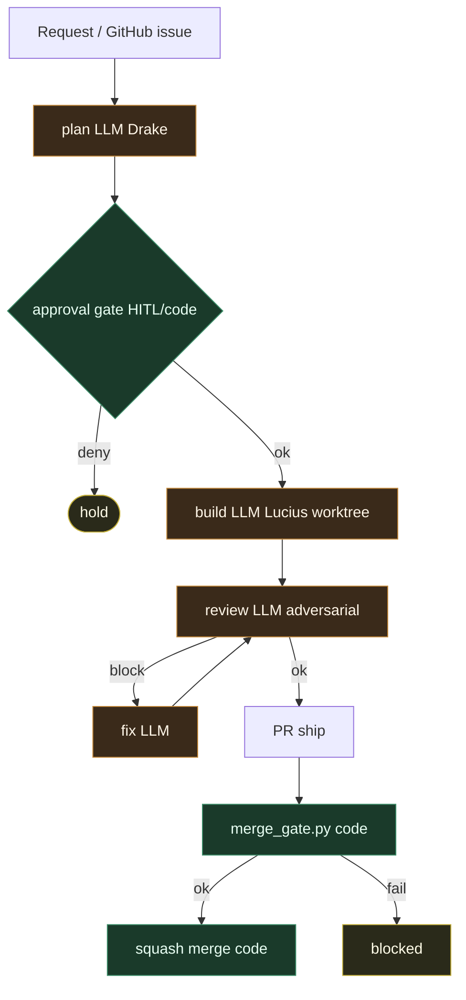

# 39 — Luminik pipeline (alfred compose)

**Persona:** `luminik-pipeline compose` — stała sekwencja **plan → approve → build → review → fix → ship** jak [luminik-io/alfred](https://github.com/luminik-io/alfred); `lib/merge_gate.py` = **jeden predykat** (nie persona). Claude / Codex / OpenCode tylko w slotach ról.

**Approach:** `compose`. Mapowanie instance `luminik-io-alfred` (`spine_deterministic`, conf 80) na duszę klepacza. Orkiestracja = kod + policy YAML/env — nie DOT→GHA-compile jak gp-foundry.

## Design notes

- **FIXED stages.** Python stage machine prowadzi ticket przez sześć stopni. LLM **nie** wybiera następnego etapu (zero ReAct orchestratora).
- **Role = liście.** Plan (Drake), build (Lucius / worktree), adversarial review, fix — structured slots. Engine routing Claude↔Codex↔OpenCode = **DET code**.
- **Approve = HITL/code gate.** Zaplanowana robota stoi za bramką; Alfred nie „wyczuwa vibe’u” — czeka na skonfigurowaną zgodę.
- **Build w izolowanym worktree.** Lock + recovery wokół lifecycle; builder ≠ reviewer (osobna sesja / silnik).
- **Fix → review, nie ship.** Valid findings wracają do adversarial review; ship dopiero po zielonym review.
- **`merge_gate.py` = sole merge authority.** Predykat fail-closed nad GitHub-native state (approvals exact-head, threads, `mergeStateStatus=CLEAN`, check runs). Mutable bot comment **nigdy** nie wystarcza sam.
- **SHA-guarded squash.** Po pierwszym pass — drugi snapshot; `gh pr merge --squash --match-head-commit <sha>`. Push w oknie mutacji = reject przez GitHub.
- **Coder ceiling.** Role dochodzą do otwartego PR (`ship`); merge wykonuje skrypt **tylko** gdy predykat mówi ok. Domyślnie człowiek / Off.
- **Meat ≡ AI.** To samo siedzenie w łańcuchu; graf się nie zmienia gdy liść wypełnia klepacz vs model.
- **NOT L5.** Zdejmujemy klepanie stage babysitting — nie lights-out bank, nie „wyrzuć inżyniera”.

## Top-level flowchart

**Alfred fleet stages (fixed)**

**DET vs AGENT at a glance**

| Layer | Mode | Merge authority? | Why |
|-------|------|------------------|-----|
| Stage machine / preflight / claim | DET | no | fixed next stage |
| Engine routing Claude↔Codex↔OpenCode | DET | no | code, nie prompt |
| plan / build / review / fix roles | AGENT leaf | never | entropy w slotach |
| Approval gate HITL/code | DET / HITL | no | ryzykowne akcje stoją |
| Worktree lock + open PR | DET | no | plumbing |
| `lib/merge_gate.py` | **DET predicate** | **yes — sole** | GitHub-native facts |
| SHA-guarded squash | DET | executes | tylko po double-check |

## Index of subgraphs

| File | Theme | Role in chain |
|------|--------|----------------|
| [subgraph-stage-spine.md](./subgraph-stage-spine.md) | fixed Python stage machine | DET spine plan→…→ship; zero LLM router |
| [subgraph-plan-approve.md](./subgraph-plan-approve.md) | Drake plan + HITL/code gate | AGENT plan leaf → DET/HITL approve |
| [subgraph-build-review-fix.md](./subgraph-build-review-fix.md) | Lucius build → adversarial review → fix | worktree + independent review loop |
| [subgraph-ship-merge-gate.md](./subgraph-ship-merge-gate.md) | ship PR → `merge_gate.py` → squash | **sole DET merge predicate** |

## Compose map (alfred → klepacz)

| Alfred concept | Klepacz seat |
|----------------|--------------|
| Request / labeled issue | intake → stage spine start |
| Python stage machine | subgraph-stage-spine (DET) |
| Drake plan LLM | subgraph-plan-approve (AGENT leaf) |
| Approval gate HITL/code | subgraph-plan-approve (DET/HITL) |
| Lucius build worktree | subgraph-build-review-fix (AGENT leaf) |
| Adversarial review + fix | subgraph-build-review-fix (AGENT leaves) |
| Ship / open PR | subgraph-ship-merge-gate (DET) |
| `lib/merge_gate.py` | subgraph-ship-merge-gate (DET sole verdict) |
| SHA-guarded squash | DET after double snapshot |
| LLM choosing next stage | **FORBIDDEN** |
| Merge gate as named persona | **FORBIDDEN** — predicate, not role |

## Antyteza (czego tu nie ma)

- ReAct / fat tool-loop orkiestrator wybierający stage
- „LLM judge” jako merge authority
- Merge gate jako persona w guildzie (Drake/Lucius/…)
- DOT→GHA compile (to jest gp-foundry, nie alfred)
- Mutable bot comment jako jedyny dowód „ship-ready”
- L5 lights-out / agent pick z czatu

## Kryterium sukcesu

Technicznie: otwarty (opc. zmergowany SHA-guarded) PR po stałej ścieżce plan→…→ship; `merge_gate.py` fail-closed. Ludzko: inżynier nie babysittował stage transitions — energia na architekturę i niewygodne pytania QA (SOUL).

## Linki

- https://github.com/luminik-io/alfred
- https://alfred.luminik.io/docs/
- Merge gate: https://github.com/luminik-io/alfred/blob/main/docs/MERGE_GATE.md
- Instance: `dark-factory-kb/instances/luminik-io-alfred`
