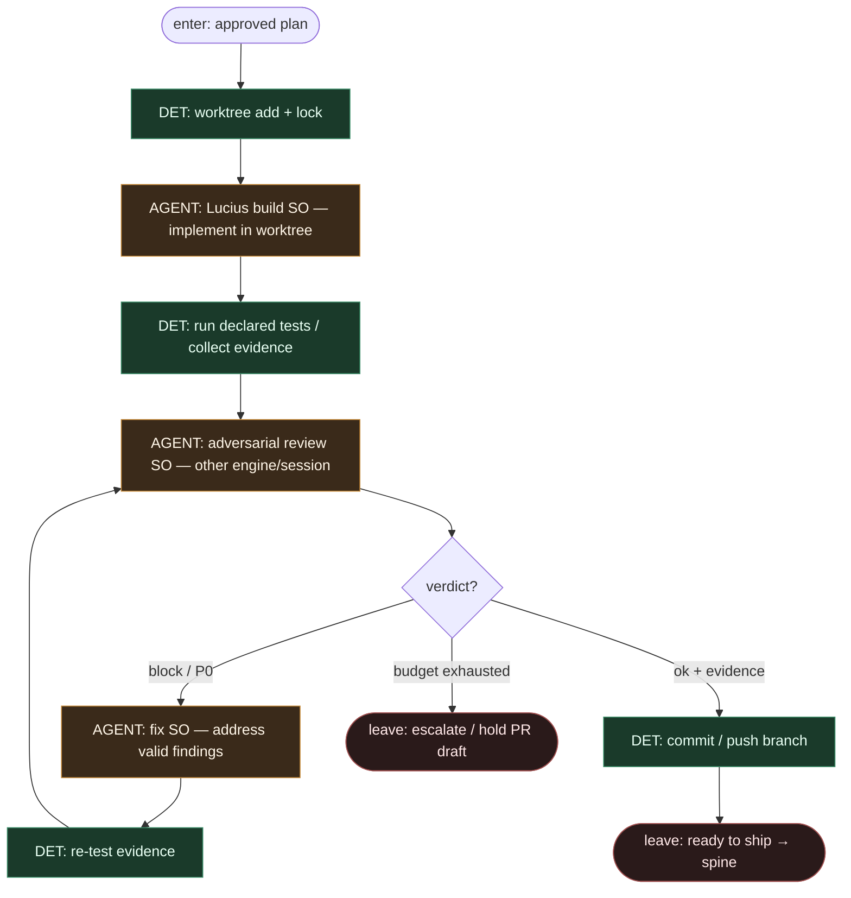

# Subgraph: build-review-fix

**Theme:** Lucius build w worktree → adversarial review → fix loop.  
**Mode mix:** DET worktree/plumbing + AGENT leaves (build / review / fix). Reviewer ≠ builder.

## Flow

## Notes

- **Isolated worktree.** Code-changing + review roles na osobnych worktree; lock + recovery wokół lifecycle (alfred).
- **Independent review.** Adversarial leaf ≠ ten sam chat co Lucius. Preferowany inny silnik (Claude↔Codex↔OpenCode).
- **Evidence on PR path.** Verification evidence domyślnie z build/test — człowiek może sprawdzić co biegło.
- **Fix → review only.** Po fix zawsze ponowny review; **zakaz** skoku do `ship` z niesprawdzonym diffem.
- **Bounded attempts.** Halt repeated failing runs — nie nieskończony Ralph w środku stage.
- **Vacuous-green refusal.** Brak zadeklarowanych testów = hold/warn w evidence, nie silent pass do ship.
- **Handoff.** `{branch, head_sha, evidence, review_so, fix_attempts}` → ship-merge-gate.
