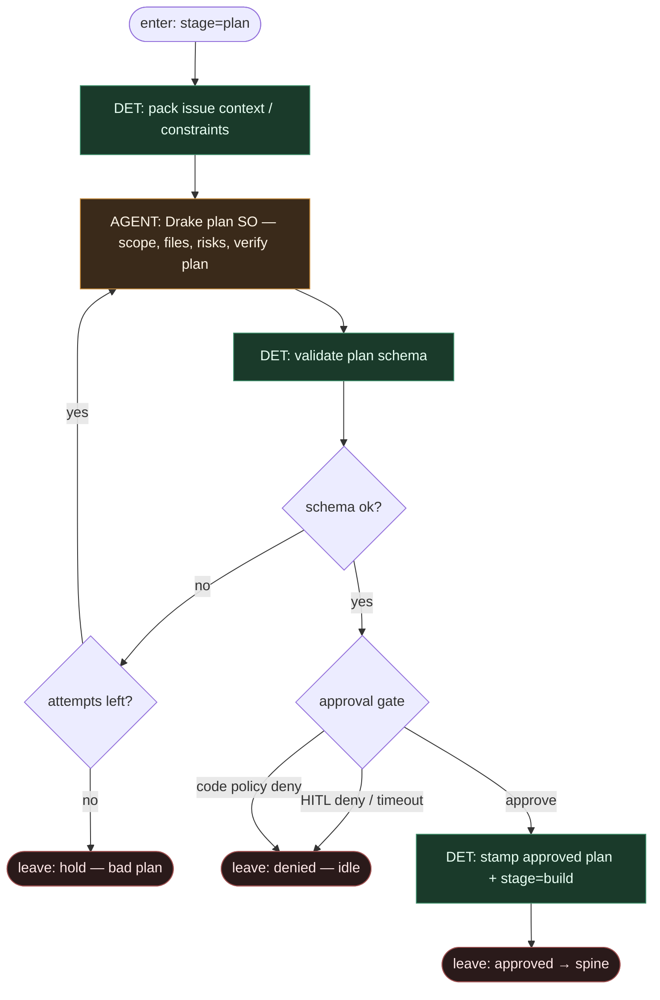

# Subgraph: plan-approve

**Theme:** Drake plan (LLM leaf) → approval gate HITL/code.  
**Mode mix:** AGENT plan + DET/HITL approve. Zero merge.

## Flow

## Notes

- **Plan is bounded SO.** Scope, touched paths, test commands, risks — nie swobodny esej. Schema fail = retry albo hold.
- **Approve ≠ merge.** Gate zatrzymuje *ryzykowne wejście w build*; nie klik merge.
- **HITL first-class.** Konfigurowalna zgoda (UI / reaction / code allowlist). Alfred „nie merguje własnych PR by default” — ta sama filozofia na approve.
- **Engine = DET route.** Claude/Codex/OpenCode wypełnia slot Drake; routing nie jest promptem „wybierz model”.
- **Handoff.** `{plan_so, approved:true, stamp}` | `{approved:false, reason}`.
