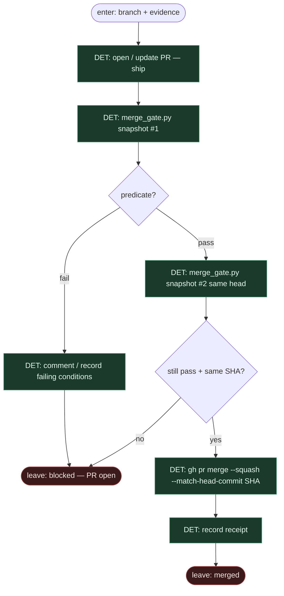

# Subgraph: ship-merge-gate

**Theme:** otwórz PR (`ship`) → `lib/merge_gate.py` predykat → SHA-guarded squash albo block.  
**Mode mix:** **100% DET.** Tu nie ma persony merge. Tu kończy się wiara w „LLM LGTM”.

## Flow

## Predykat `lib/merge_gate.py` (alfred — szkic intencji)

Wszystkie muszą trzymać; dowolny błąd API / brakujące pole / nierozpoznana wartość → **not mergeable** (fail-closed):

1. PR jest **open**
2. Brak `CHANGES_REQUESTED` / `REVIEW_REQUIRED`; ≥ `ALFRED_MERGE_MIN_APPROVALS` distinct approvals na **exact current head**
3. Zero unresolved review threads (dowolny autor)
4. Effective base-branch rules **wymagają** thread resolution (weryfikowalne; inaczej fail-closed)
5. `mergeStateStatus == CLEAN` i `mergeable == MERGEABLE` (`UNSTABLE` / `BLOCKED` / `DIRTY` / `BEHIND` / `UNKNOWN` = fail)
6. Żaden check run w failing conclusion
7. Każdy external reviewer z `ALFRED_MERGE_REQUIRED_EXTERNAL_REVIEWS` ma clean verdict na exact head **oraz** native non-bypassable guard (domyślnie lista pusta → tylko GitHub native)

**CLI:** `alfred pr check` (read-only) / `alfred pr merge` (check + SHA-guarded squash).

## Notes

- **Sole merge authority.** Tylko ten podgraf woła merge — i tylko po double-check predykatu.
- **Predicate ≠ persona.** Nie „Merger agent”. Kod + GitHub-native enforcement boundary.
- **Mutable bot comment never enough.** External adapters (Greptile / Codex, …) tylko gdy native check/thread guard jest aktywny i nie-bypassowalny.
- **Human path first-class.** Fail → PR zostaje; człowiek merguje albo wraca fix/review. Default alfred: nie auto-merge własnych PR bez policy.
- **Off / Classify / Always** może owijać *kiedy* wołać predykat; sam werdykt zawsze z `merge_gate.py`, nie z promptu.
- **Handoff.** `{merged:true, sha, gate_json}` | `{merged:false, failing_conditions[]}`.
