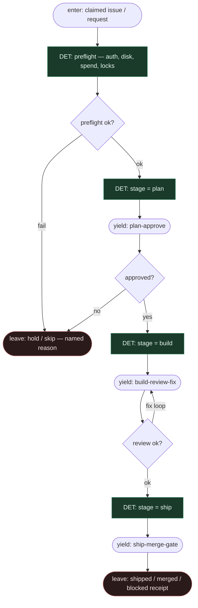

# Subgraph: stage-spine

**Theme:** stała maszyna stanów `plan → approve → build → review → fix → ship` w Pythonie.  
**Mode mix:** **100% DET** w ciele spine. LLM tylko gdy spine **yield** do role leaf.

## Flow

## Notes

- **Spine owns next stage.** Żaden liść LLM nie robi `stage = …`. Advance = kod po structured handoff.
- **Preflight before spend.** Auth silnika, worktree lock, disk, spend limits — fail → named hold, nie „agent napraw świat”.
- **One ticket, one run.** Claim + occupancy K=1; brak batch theatre.
- **Fix is a stage, not a vibe.** Po `review=block` spine ustawia `fix` i wraca do review — nie skok do ship.
- **Handoff.** `{stage, ticket_id, worktree?, attempt, receipt}` → podgraf; powrót zawsze przez DET transition table.
- **NOT:** ReAct router, label-swap FSM (to jnurre/hue), DOT compile (gp-foundry).
