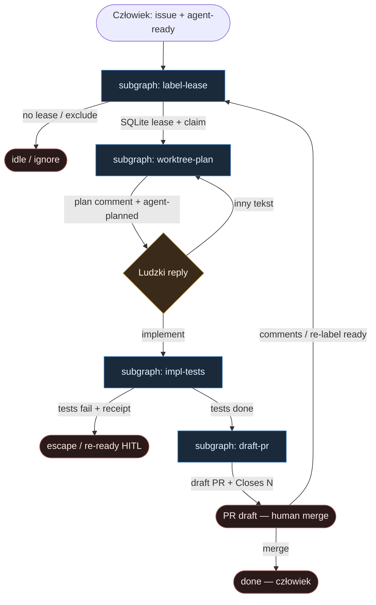

# 40 — AbleInc FSM (harness-owned loop)

**Persona:** `ableinc-fsm compose` — wierność [ableinc/coding-agent-loop](https://github.com/ableinc/coding-agent-loop): **stała label FSM** + lokalny daemon Go. Harness **własnie** claim / worktree / testy / draft PR; LLM **tylko** plan i implement. Nigdy nie merguje.

**Approach:** `compose_ableinc_fsm`. Impulse = etykieta `agent-ready`. Plan → komentarz + `agent-planned` → ludzki reply `implement` → implement → suite testów → `gh pr create --draft`. Claude Code nie pushuje i nie otwiera PR.

## Design notes

- **Fixed label FSM.** Słownik krótki i sztywny: `agent-ready` (start) → `agent-planned` (HITL gate). Reszta etapów (claim, worktree, tests, draft PR) żyje w harnessie + komentarzach — nie w „kreatywnych” etykietach z promptu.
- **Harness owns claim / worktree / tests / PR.** Go daemon: SQLite lease (1 issue / repo), świeży git worktree, `TEST` suite w worktree, commit + push + `gh pr create --draft --body Closes N`. Agent **nie** woła `gh` / `git push`.
- **LLM only plan / impl.** Dwa liście: `claude -p` plan mode → structured plan jako komentarz; potem `claude` implement (bypassPermissions w sandboxie). Zero orkiestracji tool-callingiem całego grafu.
- **HITL na planie.** Po `agent-planned` daemon czeka na reply `implement`. Inny tekst → rewizja planu (powrót do plan leaf). Człowiek zatwierdza *kierunek*, nie klepie git.
- **Coder ceiling = draft PR.** Sukces = otwarty draft + wynik testów w body. Merge = wyłącznie człowiek. `MergePolicy` default **Off**.
- **SoT = GitHub.** Labele + komentarze = źródło prawdy; SQLite = cache + lease, nie kanon procesu.
- **DET majority.** Discovery, lease, flip labels, worktree, test gate, push, open PR — skrypt. AGENT tylko w slotach Plan / Implement.
- **Meat ≡ AI.** To samo siedzenie w liściu; graf bez zmian gdy plan/impl wypełnia klepacz vs Claude.
- **NOT L5.** Ticket→draft PR klepacz. Nie lights-out bank, nie auto-merge, nie wymyślanie ticketów.
- **Cel (SOUL):** człowiek ma energię na review — bo nie spalił dnia na claim→worktree→plan ping→test→PR.

## Top-level flowchart

**DET vs AGENT at a glance**

| Warstwa | Mode | Skąd (AbleInc) | Uwaga |
|---------|------|----------------|-------|
| Label `agent-ready` | DET impulse | discovery / human | agent nie wybiera pracy |
| SQLite lease 1/repo | DET claim | Go harness | mutex lokalny |
| Fresh git worktree | DET sandbox | harness | agent bez push/PR |
| Plan leaf `claude -p` | AGENT slot | PlanAgent | tylko plan |
| Komentarz + `agent-planned` | DET flip | harness | SoT na GH |
| Reply `implement` | HITL gate | człowiek | inaczej → replan |
| Implement leaf | AGENT slot | ImplementAgent | tylko kod w worktree |
| Repo test suite | DET gate | harness | wynik → PR body |
| Commit + push + draft PR | DET | harness `gh` | **nigdy** LLM |
| Merge | HITL | człowiek | harness never merges |

## Index of subgraphs

| File | Theme | Role in chain |
|------|--------|----------------|
| [subgraph-label-lease.md](./subgraph-label-lease.md) | `agent-ready` + SQLite lease | DET claim; fixed label spine |
| [subgraph-worktree-plan.md](./subgraph-worktree-plan.md) | worktree + plan HITL | DET sandbox; AGENT plan; `agent-planned` |
| [subgraph-impl-tests.md](./subgraph-impl-tests.md) | implement + suite | AGENT impl; DET test gate |
| [subgraph-draft-pr.md](./subgraph-draft-pr.md) | commit/push/draft PR | DET ceiling; never merge |

## Mapowanie AbleInc → klepacz

| AbleInc | Klepacz seat |
|---------|--------------|
| Label `agent-ready` | subgraph-label-lease impulse |
| SQLite lease 1 issue/repo | DET claim mutex |
| Fresh git worktree | subgraph-worktree-plan sandbox |
| `claude -p` plan mode | PlanAgent leaf |
| Plan comment + `agent-planned` | DET advance + HITL |
| Human reply `implement` | HITL gate (else replan) |
| `claude` implement bypassPermissions | ImplementAgent leaf |
| Repo tests in worktree | DET test gate (harness) |
| Commit + push + `gh pr create --draft` | subgraph-draft-pr |
| Human review / merge | MergePolicy Off |
| Claude push/PR | **FORBIDDEN** |
| Agent as FSM router | **FORBIDDEN** |

## Antyteza (czego tu nie ma)

- Agent wybierający pracę z czatu / unlabeled backlogu
- Agent sam flipujący `agent-*` / otwierający PR „z promptu”
- Auto-merge / `gh pr merge` w harnessie
- Unbounded plan/impl bez HITL `implement`
- GHA-first jako jedyny executor (tu kanon = lokalny Go daemon; GHA mirror opcjonalny)
- L5 lights-out / wymyślanie ticketów / architektura produktu w liściu

## Kryterium sukcesu

Technicznie: worktree + draft PR z `Closes #N` + wynik testów w body (pass lub fail z evidence). Ludzko: inżynier reviewuje i merguje — nie babysittował lease→plan→test→push→PR.
