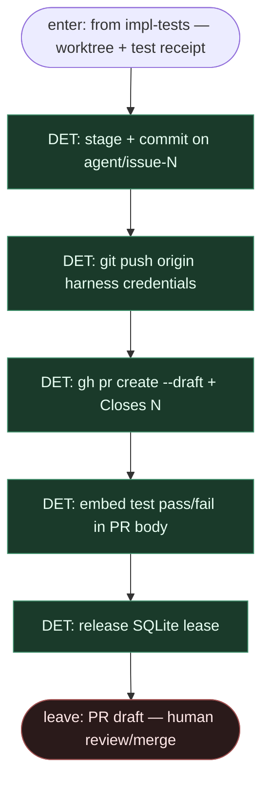

# Subgraph: draft-pr

**Theme:** harness **commit + push + `gh pr create --draft`**; coder ceiling; **nigdy merge**.  
**Mode mix:** 100% DET. Zero AGENT.

## Flow

## Notes

- **Harness-only git/GitHub write.** Claude nigdy nie woła `git push` ani `gh pr create`.
- **Draft only.** `--draft`; `MergePolicy` default Off. Człowiek merguje.
- **Closes N.** Body wiąże PR z issue; test receipt w opisie.
- **Lease release.** Po otwarciu PR (lub hard fail) SQLite lease wraca — następne `agent-ready` może wejść.
- **Escape.** Push/API fail → receipt + lease release + opcjonalny re-label HITL; nie auto-retry bez capu.
- **Handoff contract.** `{pr_url, draft: true, test_status, lease: released}` — terminal dla automatu.
