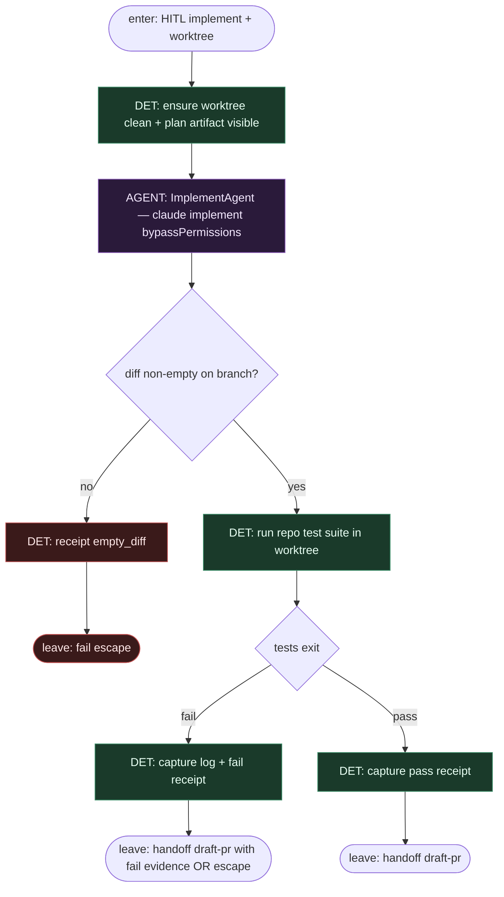

# Subgraph: impl-tests

**Theme:** liść **Implement** + **suite testów repo** w worktree; harness owns test gate.  
**Mode mix:** AGENT ImplementAgent + DET test suite.

## Flow

## Notes

- **LLM only impl.** ImplementAgent pisze kod w worktree; **nie** pushuje, **nie** otwiera PR, **nie** flipuje labels.
- **Harness owns tests.** Komenda suite z configu repo; wynik (pass/fail + log excerpt) jedzie do draft PR body.
- **bypassPermissions** dotyczy sandboxa worktree — nie host git remote / GitHub write poza harnessem.
- **Fail ≠ silent.** Fail receipt zostaje; draft-pr może i tak otworzyć PR z evidence albo escape do HITL / re-ready (policy).
- **Handoff contract.** `{worktree, branch, test_status, test_log_excerpt}` albo `{fail: empty_diff}`.
