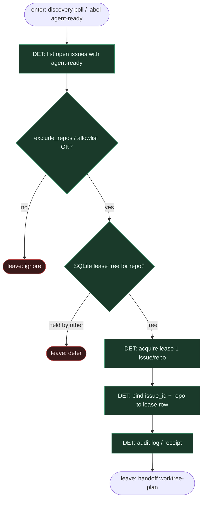

# Subgraph: label-lease

**Theme:** stała etykieta `agent-ready` + **SQLite lease** (1 issue / repo); harness owns claim.  
**Mode mix:** 100% DET. Zero AGENT w kręgosłupie.

## Flow

## Transition table (compose AbleInc)

| From | Event / predicate | To | Who |
|------|-------------------|----|-----|
| *(human)* | label `agent-ready` | claim candidate | człowiek |
| unlabeled / excluded | discovery tick | ignore | harness |
| `agent-ready` + lease free | acquire SQLite | claimed → worktree-plan | harness |
| `agent-ready` + lease held | defer | stay ready | harness |
| claimed done / fail | release lease | free for next | harness |

## Notes

- **Fixed label FSM.** Impulse = tylko `agent-ready`. Harness nie inventuje nowych stage-labels z LLM.
- **Lease = mutex.** SQLite cache: max 1 aktywne issue na repo. SoT procesu nadal na GitHub (labele/komentarze).
- **Agent never claims.** Plan/Implement nie wołają discovery ani `gh issue list`.
- **Handoff contract.** `{issue_id, repo, lease_id}` albo `{ignore|defer}`.
