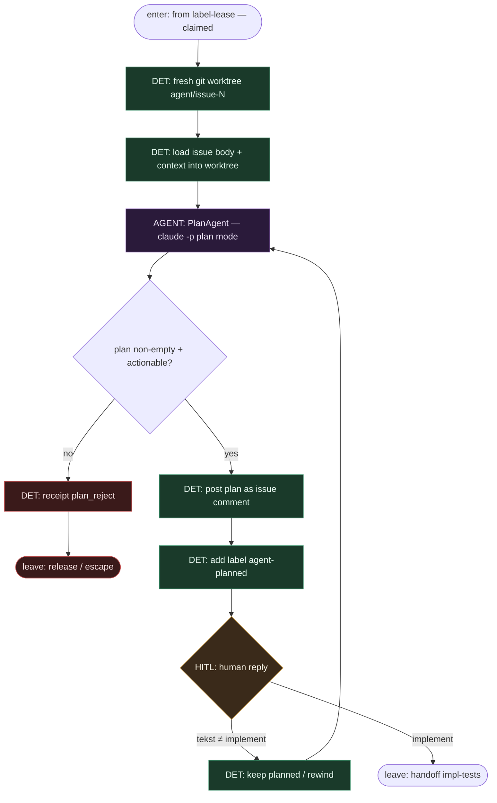

# Subgraph: worktree-plan

**Theme:** świeży **git worktree** + liść **Plan** + HITL `implement`; harness flipuje `agent-planned`.  
**Mode mix:** DET sandbox/labels + AGENT PlanAgent + HITL gate.

## Flow

## Notes

- **Harness owns worktree.** `git worktree add`; agent bez `git push` / `gh pr`.
- **LLM only plan.** `claude -p --output-format stream-json` — structured plan, nie orkiestracja FSM.
- **HITL gate.** Reply dokładnie `implement` → dalej; inaczej rewizja planu (AbleInc kanon).
- **Label `agent-planned`.** Tylko harness dokleja po komentarzu planu.
- **Meat ≡ AI.** Człowiek-klepacz może wkleić ten sam plan-komentarz bez zmiany krawędzi.
- **Handoff contract.** `{worktree, branch, plan_comment_id, label: agent-planned}` albo `{fail: plan_reject}`.
